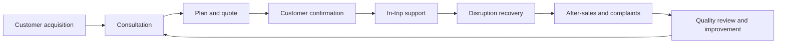
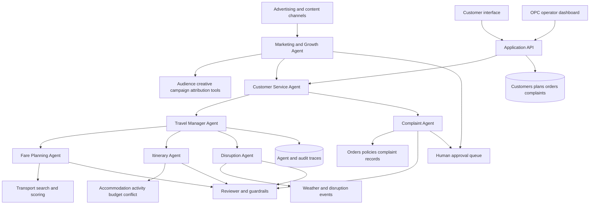
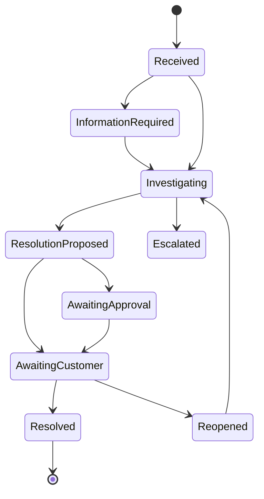
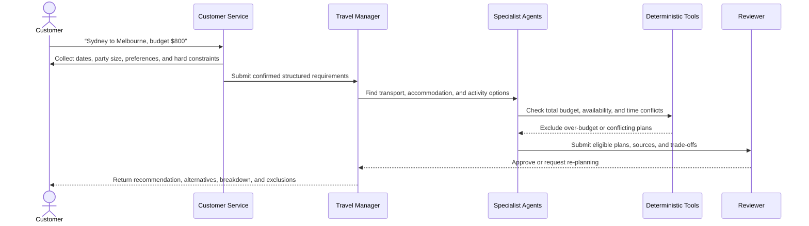

# TripMate AI

[English](README.md) | [简体中文](README.zh-CN.md)

> A feasibility study of an AI-native one-person travel company that solves real customer problems through specialised agents, deterministic tools, and human oversight.

## Project status

TripMate AI is currently in the **requirements, business validation, and architecture design stage** for ELEC5620. The repository does not yet contain a working prototype. This README describes the agreed product direction, MVP scope, operating model, planned architecture, evaluation approach, and future development.

Under the course's permitted application areas, TripMate AI is classified as a **Smart Personal Assistant** specialised in travel services. More specifically, it is a feasibility prototype for an **LLM-powered multi-agent One-Person Company (OPC)**, not merely a travel recommendation application.

## Vision

TripMate AI investigates a practical question:

**Can one human operator run a trustworthy travel service company with the support of multiple specialised AI agents?**

The objective is not to build another itinerary chatbot. The project treats TripMate AI as a real company that must acquire and understand customers, deliver a reliable service, respond when plans fail, manage complaints, control cost, protect data, and know when a human must take responsibility.

The human operator remains accountable for the company. AI agents act as virtual departments, but they do not independently perform real bookings, payments, refunds, legal decisions, or safety-critical actions.

## Alignment with the ELEC5620 project

The repository is organised around the requirements in the official course description.

| Course requirement | TripMate AI response | Planned evidence |
| --- | --- | --- |
| One-Person AI Company | One human operator supervises a virtual travel company staffed by specialised agents. | OPC operating model, operator dashboard, approval queue, and workload metrics. |
| LLM-powered multi-agent system | Agents hold different company roles and collaborate through controlled delegation. | Agent definitions, orchestration traces, collaboration and sequence diagrams. |
| Planning and decision-making | Travel Manager decomposes requests; specialists generate and revise checked proposals. | Activity/sequence models and end-to-end scenarios. |
| External tool use | Agents use transport, weather, budget, conflict, order, and policy tools. | Structured tool contracts, integration tests, and execution logs. |
| Adapt actions based on results | Tool failures, disruptions, customer revisions, and complaints trigger re-planning or escalation. | State machines, failure scenarios, plan versions, and complaint workflow. |
| Model-based software engineering | Requirements, architecture, behaviours, implementation, tests, and acceptance evidence remain traceable. | Stage 1 report, UML/model set, traceability matrix, and Stage 2 prototype. |
| Agile group development | Four members work through a shared backlog, short sprints, reviews, and retrospectives. | GitHub Issues/Projects, sprint records, commits, pull-request reviews, and contribution log. |
| Advanced technology | LLM orchestration is combined with tool calling, guardrails, structured outputs, tracing, and optional RAG. | Prototype implementation and technical evaluation. |

### Course deliverables

- **Stage 1 — 30 marks:** formal requirements/architecture/modelling report (15 marks), plus presentation and interview (15 marks).
- **Stage 2 — 20 marks:** architecture-aligned proof-of-concept implementation and stakeholder demonstration.
- The Stage 1 document must clearly identify each member's contribution.
- The Stage 2 source code must be submitted through Canvas before Monday of the final week; the demonstration takes place in the final week.
- Exact internal team deadlines will be recorded in the Agile plan once the Canvas schedule is confirmed.

## Real user problems

| User pain point | Why current solutions are insufficient | TripMate AI response |
| --- | --- | --- |
| Planning information is fragmented | Travellers compare transport, hotels, activities, weather, and budgets across many sites. | Build one constraint-aware plan from structured data and explain the trade-offs. |
| “Best” means different things | Cheapest, fastest, and most comfortable options are rarely the same. | Offer Comfort, Value, and Budget modes with transparent, configurable scoring. |
| Hidden constraints are easily missed | Baggage, accessibility, arrival time, transfers, and activity schedules can invalidate a plan. | Apply hard constraints before ranking and run deterministic budget/conflict checks. |
| Plans become obsolete | Weather, cancellations, price changes, and venue closures can break an itinerary. | Detect affected items, generate alternatives, and preserve auditable plan versions. |
| Automated support lacks accountability | Customers often receive generic replies and repeat their story after a problem occurs. | Connect complaints to the order, evidence, policy, agent trace, and a clear escalation path. |
| Travellers do not know whether AI information is reliable | Generative systems can invent prices, availability, and policies. | Separate LLM reasoning from verified data tools, show sources/timestamps, and refuse unsupported claims. |

## Target users and initial market

The MVP focuses on individual travellers planning short Australian domestic trips. The first supported scenario is a Sydney–Melbourne trip using simulated transport, accommodation, activity, and disruption data.

Initial user groups include:

- Budget-conscious students and solo travellers.
- Time-constrained travellers who value a fast comparison of valid options.
- Customers who need a clear recovery path when a plan changes.
- A human travel-service operator who needs visibility, approval controls, and manageable workload.

## Value proposition

For travellers, TripMate AI offers one place to plan, compare, revise, and resolve problems. For the operator, it automates repetitive research and support work while retaining control over financial, legal, and high-risk decisions.

The OPC hypothesis is considered feasible only if the system can demonstrate that:

- A single operator can supervise several simultaneous customer journeys.
- Routine planning and support tasks are completed with acceptable quality.
- Exceptions are prioritised instead of overwhelming the operator.
- Recommendations are traceable to data and business rules.
- Model/API cost and human handling time remain proportionate to the value delivered.
- Customers have a clear route to correction, complaint, and human review.

## Company operating model



The course prototype concentrates on consultation through after-sales support and uses simulated campaigns to validate the acquisition loop. The Marketing & Growth Agent may analyse audiences, generate advertising assets, recommend channels and budget allocation, and report performance, but it may not purchase ads, increase budgets, or publish externally without operator approval. Billing, supplier contracts, and full profitability validation remain future work.

## AI agent organisation

| Agent | Virtual company role | Responsibilities |
| --- | --- | --- |
| Marketing & Growth Agent | Customer acquisition specialist | Define audiences, plan paid advertising, create channel-specific assets, track leads and conversion, and recommend marketing improvements to the operator. |
| Customer Service Agent | Front desk | Detect intent, collect missing information, answer routine questions, and route planning or complaint requests. |
| Travel Manager Agent | Operations manager | Own the case, decompose work, coordinate specialists, combine results, and manage the service lifecycle. |
| Fare Planning Agent | Transport specialist | Filter transport options, apply the selected travel mode, rank candidates, and explain trade-offs. |
| Itinerary Agent | Travel consultant | Coordinate accommodation, activities, transport times, customer preferences, and budget. |
| Disruption Agent | Recovery specialist | Identify affected items and propose alternatives after weather changes, delays, cancellations, or closures. |
| Complaint Agent | Resolution specialist | Classify complaints, collect evidence, check policy, propose resolutions, and escalate high-risk cases. |
| Reviewer/Guardrail | Quality and compliance | Check constraints, arithmetic, conflicts, evidence, policy, confidence, and authorisation. |

The Travel Manager owns each travel-service case; the Marketing & Growth Agent owns acquisition campaigns. Specialist agents cannot make unrestricted order changes or spend advertising budget. Every hand-off, tool call, material decision, and approval is recorded.

## High-level architecture



The Marketing & Growth Agent may autonomously plan and analyse campaigns only against simulated data. Real advertising, external messaging, or budget expenditure always enters the human approval queue.

### Proposed implementation stack

- Python and FastAPI for the application service.
- One agent orchestration framework, selected after a small technical spike.
- Streamlit for the first customer/operator interface; React is a future option.
- SQLite for the prototype and PostgreSQL as a later production option.
- Pydantic schemas and deterministic domain services for validation.
- Pytest for unit, integration, scenario, and regression tests.
- GitHub Issues/Projects for the Agile backlog and contribution evidence.

## Core travel modes

| Factor | Comfort | Value | Budget |
| --- | ---: | ---: | ---: |
| Price | 20% | 40% | 65% |
| Journey time | 30% | 25% | 15% |
| Comfort | 35% | 20% | 5% |
| Reliability/transfers | 15% | 15% | 15% |

These are initial configurable weights. Hard constraints—such as budget ceiling, dates, latest arrival, baggage, accessibility, transfer limit, overnight travel, availability, and cancellation status—are applied before scoring. A hard constraint is an eligibility rule, not a weighted preference, and cannot be offset by a higher comfort, speed, or reliability score. For example, if the user's total budget is **$500**, every complete plan with an estimated total above **$500** must be excluded before scoring, ranking, or recommendation; the exclusion reason and calculation must be recorded.

```text
score = price_score * Wp
      + duration_score * Wt
      + comfort_score * Wc
      + reliability_score * Wr
```

The LLM extracts preferences and explains results. Deterministic code filters options, performs arithmetic, detects conflicts, and ranks candidates. A recommendation must include alternatives, a cost breakdown, trade-offs, data timestamps, and excluded options with reasons.

## Core customer workflows

### 1. Plan and compare

1. The customer provides route, dates, budget, travel mode, preferences, and hard constraints.
2. Customer Service validates the request and asks for missing information.
3. Travel Manager creates a structured case and delegates research.
4. Fare Planning filters and ranks transport options.
5. Itinerary Agent adds accommodation and activities.
6. Budget and schedule tools validate the plan.
7. Reviewer checks evidence, policy, constraints, and confidence.
8. The customer receives a recommended plan, alternatives, and explanations.
9. Customer confirmation creates a simulated order and immutable plan version.

**Alternative/error flows:** if information is incomplete, planning pauses and the customer is asked to clarify it. If no candidate satisfies every hard constraint, the system must not return a “closest” but invalid plan; it explains why no valid plan exists and asks the customer to explicitly relax a constraint. A timeout or stale data produces an error/degraded result, never an LLM-invented price or availability claim.

### 2. Change preference mode

The customer can switch between Comfort, Value, and Budget. The system recalculates the plan and displays differences in price, duration, transfers, comfort, reliability, and affected activities.

### 3. Recover from disruption

TripMate AI is not a one-off plan delivered only before departure. During an active trip, the customer may call the AI at any time each day to recheck today's and upcoming route. The system retrieves timestamped transport, weather, strike, road/rail disruption, and venue status, matches new events to the active itinerary, identifies affected items, generates alternatives, reruns budget/conflict checks, and asks the customer whether to accept a new version. The original plan and the data snapshot used one month earlier remain available for comparison, audit, and complaint investigation.

Rechecking may be initiated by the customer or by a simulated event, but the system never overwrites the active itinerary or performs a real rebooking without confirmation. If current data is unavailable, it reports “unable to verify” rather than presenting old information as live status.

### 4. Handle a complaint

The Complaint Agent links the complaint to an order, conversation, quote, data snapshot, and execution trace. It classifies the category and severity, checks company policy, proposes a resolution, and requests human approval when required.



P1 safety issues and P2 cancellations or material financial disputes are prioritised for human attention. Human approval is mandatory for safety concerns, legal threats, uncertain policies, compensation above a threshold, low-confidence responsibility decisions, and repeated customer rejection.

### 5. Acquire and market to customers

1. The operator sets an objective, target audience, campaign ceiling, permitted channels, and prohibited claims.
2. The Marketing & Growth Agent analyses simulated audience, channel-cost, and historical-conversion data.
3. It creates ad copy, creative briefs, landing-page propositions, audience segments, and a proposed budget allocation.
4. Reviewer checks factual support, brand rules, privacy, discriminatory targeting, disclaimers, and the budget ceiling.
5. The operator approves, edits, or rejects the campaign; no real publication or spend occurs without approval.
6. An approved simulated campaign produces source-tagged leads that Customer Service continues into consultation.
7. The agent reports impressions, clicks, acquisition cost, qualified-lead rate, and conversion, then recommends pausing, continuing, or adjusting the campaign.

### Example customer journey: Sydney to Melbourne with an $800 budget



The expected outcome is that AI first completes the requirements, the Travel Manager coordinates specialists to find options, and deterministic budget and schedule tools validate them. The final recommendation contains only plans at or below $800 with no schedule conflict. If none qualifies, the system explains why and changes no constraint without the customer's agreement.

## Edge-case runtime scenarios

### EC-01: Budget-boundary filtering

**Scenario:** the user sets a total budget of $500. Candidate plan A totals $480, plan B totals $500, and plan C totals $501.

**Runtime:** the budget tool first calculates each complete plan total, including transport, accommodation, activities, and applicable fees, and then applies FR-03. A and B may proceed to scoring. C must be excluded before scoring and record `budget_ceiling_exceeded`, the $500 ceiling, the $501 total, and the $1 excess. C cannot appear as a recommendation or alternative regardless of its time or comfort score.

**Expected result:** every returned plan costs no more than $500. If all candidates exceed the ceiling, the system returns “no eligible plan,” states the lowest feasible total, and asks whether the user wants to change the budget or another constraint; it never relaxes one autonomously.

### EC-02: Daily in-trip recheck and disruption re-planning

**Scenario:** one month earlier, the confirmed plan recommended travelling by train. On the travel day, the customer calls the AI again to view the route. Current tool data reports a landslide or rail strike, making the original service cancelled, suspended, or unreliable.

**Runtime:**

1. Load the active itinerary, original hard constraints, remaining budget, and completed items.
2. Re-query current rail operations, roads, flights, weather, and safety/disruption information, showing source and update time.
3. Disruption Agent checks whether the original train plan remains valid; a cancelled or unreachable option becomes ineligible and is not scored.
4. Search feasible alternatives, such as a flight, coach, delayed departure, or adjusted same-day activities.
5. Deterministic tools recheck incremental cost, remaining total budget, arrival time, transfers, and activity conflicts; score only eligible alternatives.
6. Show the recommendation, alternatives, differences from the old version, extra cost, affected items, and data timestamp.
7. Create a new itinerary version only after customer confirmation and preserve the old version. If no safe and compliant alternative exists, state that clearly and escalate to human support.

**Expected result:** the AI replans the best currently valid option instead of repeating the month-old train recommendation. The customer can repeat this flow every day or after any event during the trip.

### Additional edge cases

| ID | Edge case | Required runtime behaviour | Prohibited behaviour / acceptance result |
| --- | --- | --- | --- |
| EC-03 | **Contradictory requirements:** the user requests a $300 total budget, a five-star hotel, and same-day arrival, but no option satisfies all three. | Flag the likely contradiction before searching; after hard-constraint filtering, return no solution and explain which constraints cause it and the effect of relaxing each one. | Never silently downgrade the hotel, raise the budget, or change dates; alter requirements only after explicit confirmation. |
| EC-04 | **No inventory or sold out:** the route exists, but transport or accommodation has no availability on the requested dates. | Return “no eligible inventory” and the last query time; optionally search nearby dates, stations/airports, or wait-list choices and label them clearly as suggestions. | Never present historical inventory, a wait list, or inferred availability as confirmed. |
| EC-05 | **Price changes before confirmation:** a plan was $480 one month ago but is $530 on the travel-day recheck, above the $500 ceiling. | Mark the price snapshot as changed, recalculate the complete plan, and reapply FR-03; make the old over-budget option ineligible and search for alternatives. | Never reuse the old price to make the plan appear compliant or raise the budget without consent. |
| EC-06 | **Live source failure or disagreement:** the rail API times out, or two sources disagree about service status. | Use bounded retries and a fallback source, exposing source, timestamp, and uncertainty; if status cannot be verified, stop automatic recommendation and offer human support. | Never let the LLM guess that the service is operating or hide a high-impact conflict behind simple majority voting. |
| EC-07 | **Time zone, daylight-saving, or impossible transfer:** an interstate connection appears to allow 20 minutes but has already departed after conversion. | Store timezone-aware values, display local time, normalise for validation, and include walking, baggage collection, security, and minimum-transfer buffers. | Exclude every combination that conflicts after conversion or falls below the transfer buffer. |
| EC-08 | **Baggage, accessibility, or special requirement not met:** the cheapest option excludes required baggage or the station lacks required accessible facilities. | Treat confirmed baggage and accessibility needs as hard constraints, retrieve supporting evidence, and filter before scoring. Ask for clarification or human verification when evidence is missing. | Never allow a low price or high score to offset an accessibility, health-related, or baggage hard constraint. |
| EC-09 | **Trip partly completed:** the customer has checked in and completed a morning activity when afternoon transport is cancelled. | Lock completed and non-refundable items; replan only affected future items, validate against remaining budget and incremental cost, and show sunk versus new cost. | Never delete completed history, duplicate a booking, or treat the full original budget as unspent. |
| EC-10 | **Duplicate event or repeated request:** the same strike alert arrives several times, or the customer repeatedly presses replan. | Deduplicate with event ID, itinerary version, and idempotency key; reuse results for the same inputs/data snapshot and create a candidate version only for new information. | Never create duplicate orders, approvals, costs, or an infinite re-planning loop. |
| EC-11 | **Danger or emergency:** bushfire, flood, landslide, or medical/personal-safety risk affects the trip. | Prioritise official safety information and emergency contacts, suspend ordinary optimisation, make safety the highest-order hard constraint, and escalate to a human. | Never describe an AI recommendation as emergency, safety, medical, or official evacuation instruction, or recommend a risky route to save money. |

These cases must enter the scenario test set. Every test should verify correct filtering, version preservation, timestamp/uncertainty display, prevention of unauthorised action, and human escalation when no safe answer exists.

## Use case specifications

| ID | Use case | Primary actors | Preconditions | Successful outcome | Key exceptions |
| --- | --- | --- | --- | --- | --- |
| UC-01 | Create and compare a travel plan | Traveller, Customer Service, Travel Manager | The user can confirm route, dates, and budget; simulated data is available | A recommendation and alternatives pass hard-constraint, budget, and conflict checks | Missing information, no eligible inventory, tool failure, or contradictory requirements |
| UC-02 | Revise preferences and compare versions | Traveller, Travel Manager | A plan version exists | A new version shows price, time, and experience differences while preserving the old version | New preferences make the request infeasible or over budget |
| UC-03 | Recheck an active trip and recover from disruption | Traveller, Disruption Agent, operator | An active simulated order exists; the customer requests a recheck or a relevant event arrives | Current data identifies affected items and revalidated alternatives are offered | Live data unavailable, no alternative, excessive extra cost, or safety risk |
| UC-04 | Investigate and resolve a complaint | Traveller, Complaint Agent, operator | The complaint is linked to an order or the customer can provide required evidence | An evidence-based outcome is recorded and human approval is completed when needed | Unclear policy, legal/safety risk, or reopened complaint |
| UC-05 | Plan and evaluate an acquisition campaign | Operator, Marketing & Growth Agent, Reviewer | Audience, channels, budget ceiling, and brand rules are set | An approved simulated campaign produces traceable leads and a performance report | Unsupported claims, non-compliant targeting, budget breach, or rejected approval |

### UC-01 detailed main success scenario

1. The traveller submits a route and budget in natural language.
2. Customer Service extracts fields and confirms dates, party size, mode, baggage, arrival time, and other missing constraints.
3. Travel Manager creates a case and delegates transport and itinerary research.
4. Search tools return candidates with price, availability, timestamp, and source.
5. The hard-constraint filter removes every ineligible combination first; with a $500 budget, every combination above $500 is excluded here.
6. The scorer ranks only the remaining plans according to the selected mode.
7. Budget and conflict tools recalculate totals and check connections, check-in, and activity times.
8. Reviewer verifies constraints, evidence, and confidence; failure returns the case for re-planning.
9. The system shows one recommendation, at least one eligible alternative, cost breakdown, trade-offs, and material exclusion reasons.
10. Confirmation stores a simulated order, requirement snapshot, and immutable plan version.

### UC-01 acceptance criteria

- Given a $500 user budget, when a complete candidate plan totals $501, then it is excluded before scoring and records `budget_ceiling_exceeded`.
- Given every candidate violates at least one hard constraint, when filtering completes, then no invalid plan is recommended and the result identifies constraints the user may choose to relax.
- Given tool data shows a transport/activity time conflict, when Reviewer checks the plan, then the plan is rejected and re-planning begins.
- Given a recommendation passes all checks, when displayed, then it includes total price, data timestamp, sources, alternatives, trade-offs, and exclusion reasons.

## User stories

| ID | User story | Acceptance focus |
| --- | --- | --- |
| US-01 | As a budget-conscious traveller, I want plans above my total budget excluded so that I never receive an unaffordable recommendation. | Exclude before scoring; show the budget calculation and reason. |
| US-02 | As a time-constrained traveller, I want the system to complete missing details after one natural-language request so that I can form a valid request quickly. | Do not finalise planning before required fields are confirmed; allow correction. |
| US-03 | As a traveller, I want to compare Comfort, Value, and Budget modes so that I understand the price/experience trade-off. | Produce comparable versions under the same hard constraints and show differences. |
| US-04 | As a traveller affected by weather or cancellation, I want a replacement rechecked for budget and timing. | Change only affected items, preserve the old version, and rerun relevant checks. |
| US-05 | As a complainant, I want the outcome to cite my order, evidence, and policy and allow human review. | Trace the case end to end and escalate high-risk cases automatically. |
| US-06 | As the one-person operator, I want work sorted by risk and deadline so that I address the most important exceptions first. | Show priority, reason, age, suggested action, and approval history. |
| US-07 | As the operator, I want an acquisition agent to produce compliant ads and channel recommendations for a defined audience so that marketing requires less manual effort. | Output audience, assets, channels, budget, and forecast; require approval before publication. |
| US-08 | As the operator, I want to compare campaign acquisition cost and qualified-lead conversion so that I can pause or expand the right campaign. | Trace metric definitions; never let the agent autonomously increase real ad spend. |
| US-09 | As a traveller already on a trip, I want to ask the AI to recheck my route each day and replan after a landslide, strike, or cancellation so that I do not rely on a month-old recommendation. | Use current timestamped data on every recheck; exclude invalid options; revalidate budget/time and require confirmation for the new version. |

## Real company challenges and responses

| Challenge | Prototype response | Longer-term direction |
| --- | --- | --- |
| Customer trust | Explain recommendations, show data timestamps, preserve versions, and offer human review. | Supplier-level provenance, verified reviews, service guarantees, and transparent terms. |
| Hallucination and bad data | Structured tool results, deterministic validation, refusal when evidence is missing. | Multiple data providers, freshness monitoring, and automated data-quality scoring. |
| Supplier/API failure | Simulated failures, timeout handling, retries, fallback data, and explicit degraded status. | Provider redundancy, circuit breakers, queues, and contractual SLAs. |
| Too many support cases for one operator | Severity classification, priority queue, confidence thresholds, and routine automated responses. | Workload forecasting, SLA alerts, and temporary human escalation partners. |
| Privacy and security | Minimise stored data, separate secrets, redact logs, and use role-based operator actions. | Encryption, retention/deletion controls, security review, consent management, and incident response. |
| Legal and financial liability | Clear prototype disclaimers and no real booking/refund actions. | Jurisdiction review, terms, insurance, licences, audit controls, and professional advice. |
| Service quality drift | Fixed scenario tests, trace review, customer feedback, and prompt/version tracking. | Continuous evaluation, regression dashboards, model routing, and release gates. |
| Unit economics | Record model calls, latency, tool usage, and operator handling time. | Pricing experiments, caching, smaller-model routing, and customer lifetime-value analysis. |
| Customer acquisition | Define target personas and value proposition. | Landing-page experiments, referral loops, partnerships, SEO, and acquisition-cost measurement. |
| Business continuity | Manual takeover and exportable case records. | Backups, monitoring, disaster recovery, and documented operating procedures. |

## Functional requirements

| ID | Requirement |
| --- | --- |
| FR-01 | Collect and validate structured travel requirements from natural language. |
| FR-02 | Support Comfort, Value, and Budget modes. |
| FR-03 | Apply every hard constraint before scoring. The budget ceiling is evaluated against the estimated total plan cost: for a $500 budget, every plan above $500 must be excluded from scoring and recommendation, with its exclusion reason recorded. |
| FR-04 | Generate transport, accommodation, activity, and budget plans. |
| FR-05 | Explain recommendations, alternatives, trade-offs, and exclusions. |
| FR-06 | Calculate cost and detect schedule conflicts deterministically. |
| FR-07 | Support requirement revision and version comparison. |
| FR-08 | Use current timestamped data to detect the impact of weather, landslides, strikes, delays, cancellations, or closures on an active itinerary and propose budget- and schedule-checked alternatives. |
| FR-09 | Create, classify, investigate, escalate, and track complaints. |
| FR-10 | Consult order evidence and company policy before resolution. |
| FR-11 | Require human approval for configured high-risk actions. |
| FR-12 | Record agent hand-offs, tool calls, decisions, confidence, and outcomes. |
| FR-13 | Provide the operator with prioritised cases and an approval interface. |
| FR-14 | Capture customer feedback and link it to the delivered service. |
| FR-15 | Enable a Marketing & Growth Agent to plan paid campaigns, create compliant assets, track channels and leads, and require human approval for real publication or budget expenditure. |
| FR-16 | Allow the customer to recheck the route daily or at any time during an active trip; preserve old versions, revalidate current status, and save a new active version only after customer confirmation. |

## Requirement classification

The Stage 1 report will maintain a versioned catalogue rather than treating every idea as equally committed.

### Agreed baseline

- TripMate AI is a Smart Personal Assistant and a multi-agent OPC feasibility prototype.
- One human operator remains accountable and supervises exceptional/high-risk cases.
- The MVP uses simulated data and actions; it performs no real booking, payment, or refund.
- The first end-to-end case is an Australian domestic individual trip.
- LLM outputs are checked by deterministic tools and guardrails where correctness matters.

### Mandatory capabilities

- Distinct business-role agents that collaborate, use tools, and react to results.
- Marketing & Growth can plan simulated acquisition campaigns, create assets, track leads, and submit publication and spend for human approval.
- Customer intake, three travel modes, plan generation, comparison, and explanation.
- Deterministic budget, constraint, and schedule validation.
- Disruption-driven re-planning and auditable itinerary versions.
- Customer-initiated in-trip route rechecks, current-status validation, and incremental re-planning.
- Customer complaint classification, investigation, resolution, and human escalation.
- Operator approval, agent/tool tracing, and testable acceptance criteria.
- Stage 1 model-to-Stage 2 implementation traceability.

### Optional features

- RAG for destination, supplier, and policy knowledge.
- Real weather or travel-data integration.
- Multilingual/voice interaction, mobile client, map visualisation, and proactive notifications.
- Long-term preference memory, analytics, supplier scoring, and commercial experiments.

Optional features may enter the MVP only after all mandatory acceptance tests pass.

## Non-functional requirements

- **Correctness:** money, time, constraints, and policy rules use deterministic services.
- **Explainability:** important outputs include evidence, rationale, and limitations.
- **Safety:** agents cannot perform real financial transactions or bypass approvals.
- **Privacy:** data collection is minimised; secrets and personal data are excluded from public logs.
- **Reliability:** tool failure produces a bounded retry, fallback, or explicit error.
- **Maintainability:** agents, tools, prompts, business rules, data, and UI are modular.
- **Traceability:** requirements map to models, components, tests, and demonstration cases.
- **Usability:** customers can understand, compare, correct, complain, and request human review.
- **Operability:** one operator can see priorities, failures, cost, and pending decisions.

## Role of the LLM

The prototype must demonstrate the LLM's contribution in the three areas named by the course:

| Capability | LLM contribution | Non-LLM control |
| --- | --- | --- |
| Perception | Understand free-text goals, preferences, complaints, and disruption descriptions; detect missing information. | Pydantic/schema validation, trusted data adapters, and input guardrails. |
| Decision-making | Decompose cases, choose specialists/tools, compare trade-offs, propose re-planning or resolution. | Hard constraints, scoring functions, policy rules, confidence thresholds, and human approval. |
| Interaction | Ask clarifying questions and explain plans, changes, limitations, and complaint outcomes. | Approved templates, source/timestamp display, audit logs, and output guardrails. |

The evaluation will include cases where the LLM should ask for clarification, call a tool, refuse to invent unavailable data, revise a plan after new evidence, and escalate rather than act autonomously.

## Design assumptions

- The first prototype supports only the configured Australian routes and sample inventory.
- Supplier, weather, and order data are simulated or provided through controlled APIs.
- Prices and availability are snapshots and are not commercial quotations.
- Each request represents one traveller with one active itinerary.
- The user provides truthful requirements and can correct extracted information before confirmation.
- Network, model, and tool calls may fail; the workflow must expose failure instead of fabricating a result.
- The human operator is available for queued high-risk decisions within the prototype demonstration.
- Course tutors act as project stakeholders for requirement finalisation and acceptance.

Assumptions will be assigned identifiers and revisited whenever a requirement or external dependency changes.

## Design rationale and considered alternatives

| Decision | Selected approach | Considered/discarded alternative | Rationale |
| --- | --- | --- | --- |
| Agent control | Manager-led orchestration with specialist tools/hand-offs. | Unrestricted group chat between all agents. | Clear ownership, predictable traces, simpler testing, and lower cost. |
| Correctness | LLM plus deterministic domain services. | Let the LLM calculate and rank everything. | Arithmetic, constraints, and policies need reproducible results. |
| Booking scope | Simulated transactions and human approval. | Connect to real payment/booking providers in the MVP. | Reduces legal, financial, security, and integration risk. |
| Data scope | Small controlled Australian dataset. | Global real-time travel marketplace. | Supports meaningful evaluation within a four-person course project. |
| Interface | Streamlit MVP with separate customer/operator views. | Full mobile and React platform immediately. | Preserves effort for agent behaviour, modelling, and evaluation. |
| Human role | Risk-based human-in-the-loop. | Fully autonomous OPC. | A realistic company needs accountability for exceptions and high-impact decisions. |

Decisions that are not selected will remain documented because the Stage 1 presentation must explain both chosen and discarded alternatives.

## Model set and traceability

The Stage 1 package is expected to contain:

- User Requirement Diagram and Feature Diagram.
- Use Case Diagram plus detailed principal use cases.
- Package Diagram, Class Diagram, Structured Class Diagram, and Collaboration Diagram.
- Activity Diagrams for planning, disruption recovery, and complaint handling.
- State Machines for travel requests/orders and complaints.
- Sequence Diagrams for planning, re-planning, complaint resolution, and human approval.
- Component relationships and extension points for future agents, tools, data providers, and interfaces.
- A traceability matrix linking requirement → use case/model → component → test → acceptance evidence.

The README diagrams are high-level orientation only and do not replace the formal Stage 1 models.

## Change assessment and acceptance

Every material change will be handled through a GitHub Issue containing the affected requirement IDs, rationale, priority, architecture/model impact, test impact, owner, and acceptance criteria.

A change is accepted only when:

1. Mandatory requirements and safety controls still pass.
2. Relevant diagrams and traceability links are updated.
3. Unit/integration/scenario tests provide evidence for the new behaviour.
4. The product owner/operator and relevant team reviewer approve the result.
5. Performance, model cost, operator workload, privacy, and new risks remain acceptable.

Tutor feedback that changes the agreed requirements will be recorded as a baseline revision rather than silently modifying the implementation.

## MVP boundaries

### Included

- Australian domestic short trips with a limited set of routes.
- Simulated acquisition campaigns, advertising assets, channel performance, and lead-conversion data.
- Simulated transport, accommodation, activity, order, refund, and policy data.
- One traveller per request and one connected end-to-end demonstration.
- Planning, comparison, re-planning, complaints, and human approval.
- Customer and operator views plus auditable agent traces.

### Excluded

- Real booking, payment, refund, compensation, or supplier contracts.
- International visa, legal, medical, insurance, or safety advice.
- Guaranteed real-time price or availability.
- Complex group travel and fully autonomous high-risk decisions.

## Core data entities

Customer, Lead, AudienceSegment, MarketingCampaign, AdCreative, ChannelPerformance, TravelRequest, TransportOption, AccommodationOption, Activity, ItineraryVersion, SimulatedOrder, DisruptionEvent, Complaint, CompanyPolicy, HumanApproval, CustomerFeedback, AgentExecutionLog, and CostRecord.

## Development roadmap

### Phase 0 — User and business validation

- Interview potential travellers and identify the highest-cost planning/support problems.
- Define personas, customer journey, service promise, failure policy, and OPC feasibility hypotheses.
- Prioritise one connected scenario rather than attempting a full booking platform.
- Establish the Marketing & Growth Agent's simulated acquisition workflow and validate audience, proposition, channel, and acquisition-cost assumptions.

### Phase 1 — Requirements and modelling

- Finalise functional/non-functional requirements, assumptions, acceptance criteria, and traceability.
- Produce user requirement, feature, use-case, package, class, activity, state-machine, sequence, structured-class, and collaboration models.
- Model both the customer journey and operator workflow.

### Phase 2 — Planning MVP

- Implement structured intake, Travel Manager, Fare Planning, simulated transport data, hard constraints, three modes, alternatives, and explanations.

### Phase 3 — Complete service

- Add itinerary planning, accommodation/activities, budget/conflict tools, plan versions, simulated orders, Reviewer checks, and operator trace view.

### Phase 4 — Recovery and complaints

- Add weather/disruption events, impact analysis, re-planning, complaint state management, policy lookup, priority queue, and human approval.

### Phase 5 — Evaluation and demonstration

- Run normal, failure, adversarial, user-value, and OPC workload scenarios.
- Measure quality, completion, latency, cost, escalation, and operator effort.
- Reconcile implementation with Stage 1 models and prepare the final demonstration.

### Agile evidence throughout all phases

- Prioritised product backlog with requirement IDs and acceptance criteria.
- Sprint goals, task owners, estimates, and definition of done.
- Short stand-up notes, review outcomes, and retrospective actions.
- Feature branches, focused commits, peer reviews, and linked tests.
- A decision log for architecture changes and discarded choices.
- A contribution log generated from issues, models, code, tests, reviews, and presentation work.

### Future development

- Real transport, accommodation, map, calendar, and notification integrations.
- RAG for destinations, supplier terms, and company policies.
- PostgreSQL, background workers, events, monitoring, backup, and disaster recovery.
- Multi-city/group travel, multilingual support, voice, and mobile clients.
- Consent-based customer memory and preference portability.
- Operator analytics for demand, complaints, SLA, quality, and unit economics.
- Automated evaluation datasets, model routing, caching, and regression release gates.
- Supplier reliability scoring, disruption prediction, and proactive customer support.
- Business experiments for pricing, acquisition channels, partnerships, and retention.

## Planned repository structure

```text
.
├── README.md
├── README.zh-CN.md
├── docs/{business,requirements,architecture,models,agile}/
├── src/{agents,api,domain,tools,guardrails,data,ui}/
├── tests/{unit,integration,scenarios,evaluation}/
├── data/{transport,accommodation,activities,policies}/
└── pyproject.toml
```

## Four-person team plan

| Workstream | Primary owner | Responsibilities |
| --- | --- | --- |
| Acquisition and growth operations | Member A | Marketing & Growth Agent, audiences and campaigns, advertising assets, lead attribution, growth data, and acquisition-flow tests. |
| Customer service and complaints | Member B | Customer Service, Complaint Agent, customer/operator UI, complaint states, human escalation, and user testing. |
| Planning and transport | Member C | Travel Manager, Fare Planning, scoring modes, transport/budget tools, and agent orchestration. |
| Itinerary, disruption, and assurance | Member D | Itinerary/Disruption Agents, event data, Reviewer, tracing, edge cases, and system tests. |

Architecture decisions, integration, business validation, report review, presentation, and demonstration are shared by all four members. Contributions should be evidenced through issues, commits, reviews, models, and test ownership.

Before Stage 1 submission, the placeholders below must be replaced with actual names and verified contributions:

| Member | Requirements/models | Implementation/tests | Presentation/operations | Evidence links |
| --- | --- | --- | --- | --- |
| Member A — TBD | Acquisition and campaign requirements/models | Marketing & Growth, campaigns, lead attribution, growth tests | Acquisition-flow and marketing demo | Issues/commits/models — TBD |
| Member B — TBD | Customer-service and complaint requirements/models | Customer Service, Complaint, UI, human escalation, user tests | Customer-journey and complaint demo | Issues/commits/models — TBD |
| Member C — TBD | Planning and orchestration requirements/models | Travel Manager, Fare Planning, scoring/budget tools | Architecture and travel-mode demo | Issues/commits/models — TBD |
| Member D — TBD | Itinerary, disruption, and quality requirements/models | Itinerary, Disruption, Reviewer, tracing, system tests | Testing, Agile evidence, and disruption demo | Issues/commits/models — TBD |

## Demonstration story

1. Marketing & Growth creates a simulated ad for budget-conscious travellers; operator approval produces a traceable lead.
2. The customer enters “Sydney to Melbourne, budget $800”; Customer Service collects dates, party size, and constraints.
3. Agents find candidates, and deterministic tools exclude over-budget or conflicting plans.
4. The system produces a checked itinerary and explains its evidence and trade-offs.
5. The customer switches to Comfort mode and compares the new version.
6. A simulated weather event cancels an outdoor activity.
7. TripMate AI proposes a checked alternative and reports the cost difference.
8. The customer complains that the replacement provides lower value.
9. Complaint Agent investigates the order, original evidence, trace, and policy.
10. A proposed refund enters the operator approval queue.
11. The operator decides, Customer Service explains the outcome, and feedback is recorded.

This story demonstrates user value, company operations, LLM perception, agent delegation, deterministic tools, adaptation, complaint handling, and human accountability.

## Contributing

- Create or link a GitHub Issue for each meaningful change.
- Keep feature branches scoped to one requirement or component.
- Update tests and models when behaviour changes.
- Review changes before merging and record acceptance evidence.
- Never commit API keys, real customer data, or payment information.

## Course and legal notice

TripMate AI is an ELEC5620 Group 6 educational proof of concept. It is not a commercial booking service and must not be relied on for real travel, financial, legal, medical, immigration, or safety decisions.

No licence has been selected. Until one is added, all rights remain with the repository owners.
