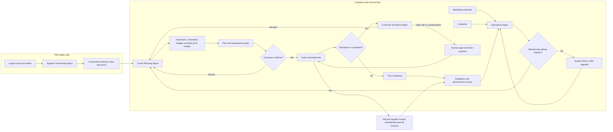
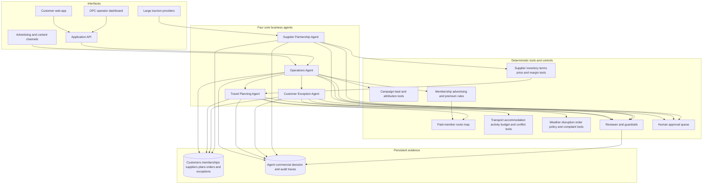
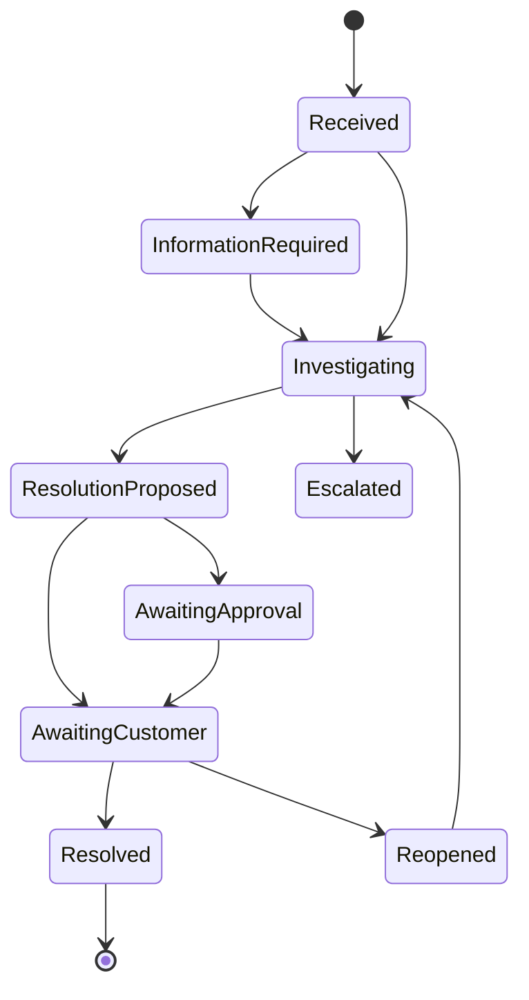
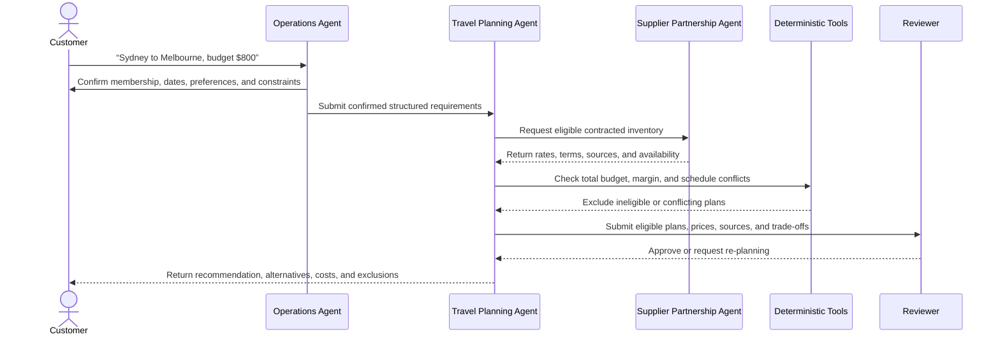

# TripMate AI

[English](README.md) | [简体中文](README.zh-CN.md)

> A feasibility study of an AI-native one-person travel company that solves real customer problems through specialised agents, deterministic tools, and human oversight.

## Project status

TripMate AI is currently in the **requirements, business validation, and architecture design stage** for ELEC5620. The repository does not yet contain a working prototype. This README describes the agreed product direction, MVP scope, operating model, planned architecture, evaluation approach, and future development.

The project will be delivered in two stages: **Stage 1 on 24 September 2026** and **Stage 2 on 5 November 2026**. Stage 1 is the current priority; the detailed Stage 2 brief has not yet been released.

Under the course's permitted application areas, TripMate AI is classified as a **Smart Personal Assistant** specialised in travel services. More specifically, it is a feasibility prototype for an **LLM-powered multi-agent One-Person Company (OPC)**, not merely a travel recommendation application.

## Vision

TripMate AI investigates a practical question:

**Can one human operator run a trustworthy travel service company with the support of multiple specialised AI agents?**

The objective is not to build another itinerary chatbot. The project treats TripMate AI as a real company that must acquire and understand customers, deliver a reliable service, respond when plans fail, manage complaints, control cost, protect data, and know when a human must take responsibility.

The human operator remains accountable for the company. AI agents act as virtual departments, but they do not independently perform real bookings, payments, refunds, legal decisions, or safety-critical actions.

## Alignment with the ELEC5620 project

The repository is organised around the requirements in the official course description.

| Course requirement | TripMate AI response | Planned evidence |
| --- | --- | --- |
| One-Person AI Company | One human operator supervises a virtual travel company staffed by specialised agents. | OPC operating model, operator dashboard, approval queue, and workload metrics. |
| LLM-powered multi-agent system | Agents hold different company roles and collaborate through controlled delegation. | Agent definitions, orchestration traces, collaboration and sequence diagrams. |
| Planning and decision-making | The Operations Agent routes requests; the Travel Planning Agent generates and revises checked proposals. | Activity/sequence models and end-to-end scenarios. |
| External tool use | Agents use transport, weather, budget, conflict, order, and policy tools. | Structured tool contracts, integration tests, and execution logs. |
| Adapt actions based on results | Tool failures, disruptions, customer revisions, and complaints trigger re-planning or escalation. | State machines, failure scenarios, plan versions, and complaint workflow. |
| Model-based software engineering | Requirements, architecture, behaviours, implementation, tests, and acceptance evidence remain traceable. | Stage 1 report, UML/model set, traceability matrix, and Stage 2 prototype. |
| Agile group development | Four members work through a shared backlog, short sprints, reviews, and retrospectives. | GitHub Issues/Projects, sprint records, commits, pull-request reviews, and contribution log. |
| Advanced technology | LLM orchestration is combined with tool calling, guardrails, structured outputs, tracing, and optional RAG. | Prototype implementation and technical evaluation. |

### Delivery milestones

The assessed work is organised into two submissions:

| Stage | Due date | Intended outcome and evidence |
| --- | --- | --- |
| **Stage 1 — Requirements, architecture, and system modelling (30 marks)** | **24 September 2026** | Present the project to the tutors: explain the project description, target users, One-Person AI Company concept, agent roles, classified requirements, key use cases, proposed architecture, design rationale, and principal design/UML models. The supporting package follows the files in [`docs/`](docs/): a requirements and modelling report (15 marks), an up-to-8-minute video presentation (5 marks), and an individual interview (10 marks). Each member's contribution must be identified clearly. |
| **Stage 2 — Prototype implementation and demonstration (20 marks)** | **5 November 2026** | Deliver an architecture-aligned proof-of-concept that implements the core agents, their collaboration and tool-use flow, and enough end-to-end behaviour for a stakeholder demonstration. The current interface direction is a small web application, most likely Streamlit, so the prototype is easy to build, run, and present. Detailed Stage 2 submission requirements and the final presentation format are still awaiting release. |

For Stage 1, the team will prioritise a concise tutor-facing project narrative and readable design diagrams, backed by consistent requirements and models. The expected model set includes feature and use-case diagrams, class and complex-structure models, activity diagrams, interaction/sequence diagrams, state machines, and clear traceability to individual contributions.

For Stage 2, the current plan is provisional until the official brief is published. The code should demonstrate how LLM-powered agents perceive requests, make decisions, collaborate, call tools, and revise actions based on results, while preserving evidence of the team's Agile development process.

Source documents: [Project Description](docs/Project%20Description.pdf), [Stage 1 Marking Criteria](docs/ELEC5620_Project_Stage_1_Marking_Criteria.pdf), and [Project Requirement Example](docs/Project_Requirement_Example.pdf).

## Real user problems

| User pain point | Why current solutions are insufficient | TripMate AI response |
| --- | --- | --- |
| Planning information is fragmented | Travellers compare transport, hotels, activities, weather, and budgets across many sites. | Build one constraint-aware plan from structured data and explain the trade-offs. |
| “Best” means different things | Cheapest, fastest, and most comfortable options are rarely the same. | Offer Comfort, Value, and Budget modes with transparent, configurable scoring. |
| Hidden constraints are easily missed | Baggage, accessibility, arrival time, transfers, and activity schedules can invalidate a plan. | Apply hard constraints before ranking and run deterministic budget/conflict checks. |
| Plans become obsolete | Weather, cancellations, price changes, and venue closures can break an itinerary. | Detect affected items, generate alternatives, and preserve auditable plan versions. |
| Automated support lacks accountability | Customers often receive generic replies and repeat their story after a problem occurs. | Connect complaints to the order, evidence, policy, agent trace, and a clear escalation path. |
| Travellers do not know whether AI information is reliable | Generative systems can invent prices, availability, and policies. | Separate LLM reasoning from verified data tools, show sources/timestamps, and refuse unsupported claims. |

## Target users and initial market

The MVP focuses on individual travellers planning short Australian domestic trips. The first supported scenario is a Sydney–Melbourne trip using simulated transport, accommodation, activity, and disruption data.

Initial user groups include:

- Budget-conscious students and solo travellers.
- Time-constrained travellers who value a fast comparison of valid options.
- Customers who need a clear recovery path when a plan changes.
- A human travel-service operator who needs visibility, approval controls, and manageable workload.
- Travel suppliers and large tourism businesses that can provide inventory at contracted or wholesale rates.

## Value proposition

For travellers, TripMate AI offers one place to plan, compare, revise, and resolve problems. For the operator, it automates repetitive research and support work while retaining control over financial, legal, and high-risk decisions.

The OPC hypothesis is considered feasible only if the system can demonstrate that:

- A single operator can supervise several simultaneous customer journeys.
- Routine planning and support tasks are completed with acceptable quality.
- Exceptions are prioritised instead of overwhelming the operator.
- Recommendations are traceable to data and business rules.
- Model/API cost and human handling time remain proportionate to the value delivered.
- Customers have a clear route to correction, complaint, and human review.

## Revenue model and membership

TripMate AI must test whether the company can earn revenue rather than only demonstrate agent functionality. The proposed model combines three complementary revenue streams:

1. **Supplier margin:** the Supplier Partnership Agent works with large travel providers to source transport, accommodation, and activity inventory at contracted or wholesale rates. TripMate AI presents a customer price and earns the disclosed difference or commission. The prototype uses simulated supplier agreements and prices; it does not execute real contracts or bookings.
2. **Paid membership:** subscribers pay a recurring fee for an ad-free experience, no free-tier limit on simultaneous trips or itinerary length, route visualisation on a map, and other advanced planning features.
3. **Advertising:** free members may see clearly labelled advertisements. Advertising must not change hard-constraint filtering or secretly distort recommendation rankings.

| Entitlement | Free member | Paid member |
| --- | --- | --- |
| Simultaneous planned/active trips | Up to **2** | No free-tier concurrency limit |
| Maximum itinerary duration | Up to **5 days per trip** | No free-tier duration limit |
| Advertising | Clearly labelled ads may appear | Ad-free |
| Core planning and re-planning | Included | Included |
| Route map and premium planning features | Not included | Included |

Limits are enforced by deterministic entitlement checks before a new trip or itinerary extension is created. Existing data must not be deleted when a limit is reached; the system instead explains the restriction and offers the customer the option to finish an active trip, shorten the request, or upgrade.

## Company operating model



The course prototype covers acquisition through after-sales support and adds a simulated commercial loop: supplier inventory is sourced at a base rate, packaged into eligible travel plans, and offered at a customer price with the margin recorded. The Operations Agent can analyse audiences, generate advertising assets, run the customer front desk, and report campaign performance, but real publication and spending still require operator approval. Membership billing, supplier contracts, bookings, and payments remain simulated.

## AI agent organisation

| Agent | Virtual company role | Responsibilities |
| --- | --- | --- |
| Operations Agent | Acquisition, marketing, and customer front desk | Define audiences and campaigns, create approved marketing content, track leads, greet customers, identify intent, collect missing information, answer routine questions, check membership entitlements, and route work to the correct agent. |
| Travel Planning Agent | End-to-end travel planner | Search and combine transport, accommodation, and activities; apply travel modes and hard constraints; build, rank, explain, and revise complete itineraries. |
| Customer Exception Agent | Disruption and complaint resolution | Monitor or receive travel disruptions, identify affected itinerary items, generate recovery options, investigate complaints against evidence and policy, and escalate high-risk or low-confidence cases. |
| Supplier Partnership Agent | B2B sourcing and commercial partnerships | Connect with large tourism providers, ingest simulated contracted inventory and terms, compare supplier rates, track availability and reliability, and calculate the company's margin without hiding customer-facing prices. |
| Reviewer/Guardrail | Quality and compliance | Check constraints, arithmetic, conflicts, evidence, policy, confidence, and authorisation. |

The Operations Agent owns the customer relationship and routes each case. The Travel Planning Agent owns valid itinerary construction, the Customer Exception Agent owns disruption and complaint cases, and the Supplier Partnership Agent owns supplier inventory and margin evidence. Reviewer/Guardrail is a cross-cutting control rather than a customer-facing department. No agent may sign a real supplier contract, publish advertising, spend budget, change an order, or issue compensation outside its approval boundary. Every hand-off, tool call, commercial calculation, material decision, and approval is recorded.

## High-level architecture



The Operations Agent may autonomously plan and analyse campaigns only against simulated data. The Supplier Partnership Agent also uses simulated supplier catalogues, rates, and agreements. Real advertising, external messaging, supplier commitments, or budget expenditure always enters the human approval queue.

### Proposed implementation stack

- Python and FastAPI for the application service.
- One agent orchestration framework, selected after a small technical spike.
- Streamlit for the first customer/operator interface; React is a future option.
- SQLite for the prototype and PostgreSQL as a later production option.
- Pydantic schemas and deterministic domain services for validation.
- Pytest for unit, integration, scenario, and regression tests.
- GitHub Issues/Projects for the Agile backlog and contribution evidence.

## Core travel modes

| Factor | Comfort | Value | Budget |
| --- | ---: | ---: | ---: |
| Price | 20% | 40% | 65% |
| Journey time | 30% | 25% | 15% |
| Comfort | 35% | 20% | 5% |
| Reliability/transfers | 15% | 15% | 15% |

These are initial configurable weights. Hard constraints—such as budget ceiling, dates, latest arrival, baggage, accessibility, transfer limit, overnight travel, availability, and cancellation status—are applied before scoring. A hard constraint is an eligibility rule, not a weighted preference, and cannot be offset by a higher comfort, speed, or reliability score. For example, if the user's total budget is **$500**, every complete plan with an estimated total above **$500** must be excluded before scoring, ranking, or recommendation; the exclusion reason and calculation must be recorded.

```text
score = price_score * Wp
      + duration_score * Wt
      + comfort_score * Wc
      + reliability_score * Wr
```

The LLM extracts preferences and explains results. Deterministic code filters options, performs arithmetic, detects conflicts, and ranks candidates. A recommendation must include alternatives, a cost breakdown, trade-offs, data timestamps, and excluded options with reasons.

## Core customer workflows

### 1. Plan and compare

1. The customer provides route, dates, budget, travel mode, preferences, and hard constraints.
2. Operations Agent validates the request, membership entitlement, and missing information.
3. Travel Planning Agent creates the structured case and obtains eligible supplier inventory.
4. Travel Planning Agent combines and ranks transport, accommodation, and activities as complete itineraries.
5. Budget, schedule, entitlement, and margin tools validate the plan.
6. Reviewer checks evidence, policy, constraints, price transparency, and confidence.
7. The customer receives a recommended plan, alternatives, and explanations.
8. Customer confirmation creates a simulated order and immutable plan version.

**Alternative/error flows:** if information is incomplete, planning pauses and the customer is asked to clarify it. If no candidate satisfies every hard constraint, the system must not return a “closest” but invalid plan; it explains why no valid plan exists and asks the customer to explicitly relax a constraint. A timeout or stale data produces an error/degraded result, never an LLM-invented price or availability claim.

### 2. Change preference mode

The customer can switch between Comfort, Value, and Budget. The system recalculates the plan and displays differences in price, duration, transfers, comfort, reliability, and affected activities.

### 3. Recover from disruption

TripMate AI is not a one-off plan delivered only before departure. During an active trip, the customer may call the AI at any time each day to recheck today's and upcoming route. The system retrieves timestamped transport, weather, strike, road/rail disruption, and venue status, matches new events to the active itinerary, identifies affected items, generates alternatives, reruns budget/conflict checks, and asks the customer whether to accept a new version. The original plan and the data snapshot used one month earlier remain available for comparison, audit, and complaint investigation.

Rechecking may be initiated by the customer or by a simulated event, but the system never overwrites the active itinerary or performs a real rebooking without confirmation. If current data is unavailable, it reports “unable to verify” rather than presenting old information as live status.

### 4. Handle disruptions and complaints

The Customer Exception Agent handles both operational disruptions and customer complaints so that the recovery decision and its later investigation share the same evidence. It links the case to the order, conversation, quote, supplier terms, data snapshot, itinerary versions, and execution trace; classifies severity; proposes recovery or resolution; and requests human approval when required.



P1 safety issues and P2 cancellations or material financial disputes are prioritised for human attention. Human approval is mandatory for safety concerns, legal threats, uncertain policies, compensation above a threshold, low-confidence responsibility decisions, and repeated customer rejection.

### 5. Acquire, market to, and serve customers

1. The operator sets an objective, target audience, campaign ceiling, permitted channels, and prohibited claims.
2. The Operations Agent analyses simulated audience, channel-cost, and historical-conversion data.
3. It creates ad copy, creative briefs, landing-page propositions, audience segments, and a proposed budget allocation.
4. Reviewer checks factual support, brand rules, privacy, discriminatory targeting, disclaimers, and the budget ceiling.
5. The operator approves, edits, or rejects the campaign; no real publication or spend occurs without approval.
6. An approved simulated campaign produces source-tagged leads that the same Operations Agent continues into front-desk consultation.
7. The agent reports impressions, clicks, acquisition cost, qualified-lead rate, and conversion, then recommends pausing, continuing, or adjusting the campaign.

### 6. Source supplier inventory and calculate margin

1. The operator defines permitted supplier types, destinations, contract rules, minimum evidence, and margin boundaries.
2. Supplier Partnership Agent imports simulated rates, availability, cancellation terms, commission rules, and service-quality data from large tourism providers.
3. It normalises offers so that Travel Planning Agent can compare equivalent resources.
4. Margin tools calculate supplier cost, customer price, commission or markup, applicable fees, and expected gross margin.
5. Reviewer checks price transparency, stale inventory, prohibited terms, and margins outside the approved range.
6. A real contract, supplier commitment, or price-rule change would require operator approval; the course prototype records only a simulated agreement.

### 7. Apply membership entitlements

Before creating or extending a plan, Operations Agent checks the customer's membership. A free member may hold at most two simultaneous planned or active trips, and each trip may span at most five days. Free members may see labelled advertisements, but ads cannot override constraints or recommendation scores. Paid members are not subject to the free-tier trip-count and duration limits, receive an ad-free experience, and can use route maps and other premium planning features.

### Example customer journey: Sydney to Melbourne with an $800 budget



The expected outcome is that Operations Agent completes intake and entitlement checks, Travel Planning Agent builds options from supplier resources, and deterministic budget, schedule, and margin tools validate them. The final recommendation contains only plans at or below $800 with no schedule conflict and with transparent pricing. If none qualifies, the system explains why and changes no constraint without the customer's agreement.

## Edge-case runtime scenarios

### EC-01: Budget-boundary filtering

**Scenario:** the user sets a total budget of $500. Candidate plan A totals $480, plan B totals $500, and plan C totals $501.

**Runtime:** the budget tool first calculates each complete plan total, including transport, accommodation, activities, and applicable fees, and then applies FR-03. A and B may proceed to scoring. C must be excluded before scoring and record `budget_ceiling_exceeded`, the $500 ceiling, the $501 total, and the $1 excess. C cannot appear as a recommendation or alternative regardless of its time or comfort score.

**Expected result:** every returned plan costs no more than $500. If all candidates exceed the ceiling, the system returns “no eligible plan,” states the lowest feasible total, and asks whether the user wants to change the budget or another constraint; it never relaxes one autonomously.

### EC-02: Daily in-trip recheck and disruption re-planning

**Scenario:** one month earlier, the confirmed plan recommended travelling by train. On the travel day, the customer calls the AI again to view the route. Current tool data reports a landslide or rail strike, making the original service cancelled, suspended, or unreliable.

**Runtime:**

1. Load the active itinerary, original hard constraints, remaining budget, and completed items.
2. Re-query current rail operations, roads, flights, weather, and safety/disruption information, showing source and update time.
3. Customer Exception Agent checks whether the original train plan remains valid; a cancelled or unreachable option becomes ineligible and is not scored.
4. Search feasible alternatives, such as a flight, coach, delayed departure, or adjusted same-day activities.
5. Deterministic tools recheck incremental cost, remaining total budget, arrival time, transfers, and activity conflicts; score only eligible alternatives.
6. Show the recommendation, alternatives, differences from the old version, extra cost, affected items, and data timestamp.
7. Create a new itinerary version only after customer confirmation and preserve the old version. If no safe and compliant alternative exists, state that clearly and escalate to human support.

**Expected result:** the AI replans the best currently valid option instead of repeating the month-old train recommendation. The customer can repeat this flow every day or after any event during the trip.

### Additional edge cases

| ID | Edge case | Required runtime behaviour | Prohibited behaviour / acceptance result |
| --- | --- | --- | --- |
| EC-03 | **Contradictory requirements:** the user requests a $300 total budget, a five-star hotel, and same-day arrival, but no option satisfies all three. | Flag the likely contradiction before searching; after hard-constraint filtering, return no solution and explain which constraints cause it and the effect of relaxing each one. | Never silently downgrade the hotel, raise the budget, or change dates; alter requirements only after explicit confirmation. |
| EC-04 | **No inventory or sold out:** the route exists, but transport or accommodation has no availability on the requested dates. | Return “no eligible inventory” and the last query time; optionally search nearby dates, stations/airports, or wait-list choices and label them clearly as suggestions. | Never present historical inventory, a wait list, or inferred availability as confirmed. |
| EC-05 | **Price changes before confirmation:** a plan was $480 one month ago but is $530 on the travel-day recheck, above the $500 ceiling. | Mark the price snapshot as changed, recalculate the complete plan, and reapply FR-03; make the old over-budget option ineligible and search for alternatives. | Never reuse the old price to make the plan appear compliant or raise the budget without consent. |
| EC-06 | **Live source failure or disagreement:** the rail API times out, or two sources disagree about service status. | Use bounded retries and a fallback source, exposing source, timestamp, and uncertainty; if status cannot be verified, stop automatic recommendation and offer human support. | Never let the LLM guess that the service is operating or hide a high-impact conflict behind simple majority voting. |
| EC-07 | **Time zone, daylight-saving, or impossible transfer:** an interstate connection appears to allow 20 minutes but has already departed after conversion. | Store timezone-aware values, display local time, normalise for validation, and include walking, baggage collection, security, and minimum-transfer buffers. | Exclude every combination that conflicts after conversion or falls below the transfer buffer. |
| EC-08 | **Baggage, accessibility, or special requirement not met:** the cheapest option excludes required baggage or the station lacks required accessible facilities. | Treat confirmed baggage and accessibility needs as hard constraints, retrieve supporting evidence, and filter before scoring. Ask for clarification or human verification when evidence is missing. | Never allow a low price or high score to offset an accessibility, health-related, or baggage hard constraint. |
| EC-09 | **Trip partly completed:** the customer has checked in and completed a morning activity when afternoon transport is cancelled. | Lock completed and non-refundable items; replan only affected future items, validate against remaining budget and incremental cost, and show sunk versus new cost. | Never delete completed history, duplicate a booking, or treat the full original budget as unspent. |
| EC-10 | **Duplicate event or repeated request:** the same strike alert arrives several times, or the customer repeatedly presses replan. | Deduplicate with event ID, itinerary version, and idempotency key; reuse results for the same inputs/data snapshot and create a candidate version only for new information. | Never create duplicate orders, approvals, costs, or an infinite re-planning loop. |
| EC-11 | **Danger or emergency:** bushfire, flood, landslide, or medical/personal-safety risk affects the trip. | Prioritise official safety information and emergency contacts, suspend ordinary optimisation, make safety the highest-order hard constraint, and escalate to a human. | Never describe an AI recommendation as emergency, safety, medical, or official evacuation instruction, or recommend a risky route to save money. |
| EC-12 | **Free-member limit reached:** a free member with two planned/active trips requests a third trip or extends one beyond five days. | Reject only the new creation/extension, preserve existing trips, explain the exact limit, and offer completion, shortening, or upgrade options. | Never delete an existing trip, silently shorten it, or let the LLM bypass entitlement rules. |
| EC-13 | **Subscription expires or changes:** a paid membership expires while several long itineraries exist. | Preserve existing itinerary data, remove future paid-only actions according to a stated grace policy, suppress no historical evidence, and ask the user to renew or reduce future requests. | Never erase maps or itinerary history, charge automatically in the prototype, or downgrade data without notice. |
| EC-14 | **Supplier price or term mismatch:** the customer quote uses a stale wholesale rate or the supplier cancellation term changed. | Re-fetch or invalidate the offer, recalculate customer price and margin, show the change, and require reconfirmation or approval where applicable. | Never conceal a negative/excessive margin, reuse invalid terms, or present an unavailable supplier offer as bookable. |

These cases must enter the scenario test set. Every test should verify correct filtering, version preservation, timestamp/uncertainty display, prevention of unauthorised action, and human escalation when no safe answer exists.

## Use case specifications

| ID | Use case | Primary actors | Preconditions | Successful outcome | Key exceptions |
| --- | --- | --- | --- | --- | --- |
| UC-01 | Create and compare a travel plan | Traveller, Operations Agent, Travel Planning Agent | The user can confirm route, dates, and budget; simulated data is available; membership allows the request | A recommendation and alternatives pass entitlement, hard-constraint, budget, margin, and conflict checks | Missing information, membership limit, no eligible inventory, tool failure, or contradictory requirements |
| UC-02 | Revise preferences and compare versions | Traveller, Travel Planning Agent | A plan version exists | A new version shows price, time, and experience differences while preserving the old version | New preferences make the request infeasible, over budget, or outside membership limits |
| UC-03 | Recheck an active trip and recover from disruption | Traveller, Customer Exception Agent, operator | An active simulated order exists; the customer requests a recheck or a relevant event arrives | Current data identifies affected items and revalidated alternatives are offered | Live data unavailable, no alternative, excessive extra cost, or safety risk |
| UC-04 | Investigate and resolve a complaint | Traveller, Customer Exception Agent, operator | The complaint is linked to an order or the customer can provide required evidence | An evidence-based outcome is recorded and human approval is completed when needed | Unclear policy, legal/safety risk, or reopened complaint |
| UC-05 | Plan and evaluate an acquisition campaign | Operator, Operations Agent, Reviewer | Audience, channels, budget ceiling, and brand rules are set | An approved simulated campaign produces traceable leads and a performance report | Unsupported claims, non-compliant targeting, budget breach, or rejected approval |
| UC-06 | Source travel inventory and validate margin | Operator, Supplier Partnership Agent, Travel Planning Agent | Simulated supplier catalogues and commercial rules are available | Comparable inventory includes source cost, customer price, terms, and expected margin | Stale inventory, incompatible terms, excessive margin, or approval required |
| UC-07 | Enforce membership and premium access | Traveller, Operations Agent | The user has a free or paid membership record | Limits, ads, map access, and premium features match the membership | Third active trip, free trip over five days, expired subscription, or entitlement-service failure |

### UC-01 detailed main success scenario

1. The traveller submits a route and budget in natural language.
2. Operations Agent extracts fields, checks membership, and confirms dates, party size, mode, baggage, arrival time, and other missing constraints.
3. Travel Planning Agent creates a case and requests transport, accommodation, and activity inventory from Supplier Partnership Agent and other permitted sources.
4. Search tools return candidates with price, availability, timestamp, and source.
5. The hard-constraint filter removes every ineligible combination first; with a $500 budget, every combination above $500 is excluded here.
6. The scorer ranks only the remaining plans according to the selected mode.
7. Budget and conflict tools recalculate totals and check connections, check-in, and activity times.
8. Reviewer verifies constraints, evidence, supplier terms, price transparency, margin, and confidence; failure returns the case for re-planning.
9. The system shows one recommendation, at least one eligible alternative, cost breakdown, trade-offs, and material exclusion reasons.
10. Confirmation stores a simulated order, requirement snapshot, and immutable plan version.

### UC-01 acceptance criteria

- Given a $500 user budget, when a complete candidate plan totals $501, then it is excluded before scoring and records `budget_ceiling_exceeded`.
- Given every candidate violates at least one hard constraint, when filtering completes, then no invalid plan is recommended and the result identifies constraints the user may choose to relax.
- Given tool data shows a transport/activity time conflict, when Reviewer checks the plan, then the plan is rejected and re-planning begins.
- Given a recommendation passes all checks, when displayed, then it includes total price, data timestamp, sources, alternatives, trade-offs, and exclusion reasons.

## User stories

| ID | User story | Acceptance focus |
| --- | --- | --- |
| US-01 | As a budget-conscious traveller, I want plans above my total budget excluded so that I never receive an unaffordable recommendation. | Exclude before scoring; show the budget calculation and reason. |
| US-02 | As a time-constrained traveller, I want the system to complete missing details after one natural-language request so that I can form a valid request quickly. | Do not finalise planning before required fields are confirmed; allow correction. |
| US-03 | As a traveller, I want to compare Comfort, Value, and Budget modes so that I understand the price/experience trade-off. | Produce comparable versions under the same hard constraints and show differences. |
| US-04 | As a traveller affected by weather or cancellation, I want a replacement rechecked for budget and timing. | Change only affected items, preserve the old version, and rerun relevant checks. |
| US-05 | As a complainant, I want the outcome to cite my order, evidence, and policy and allow human review. | Trace the case end to end and escalate high-risk cases automatically. |
| US-06 | As the one-person operator, I want work sorted by risk and deadline so that I address the most important exceptions first. | Show priority, reason, age, suggested action, and approval history. |
| US-07 | As the operator, I want an acquisition agent to produce compliant ads and channel recommendations for a defined audience so that marketing requires less manual effort. | Output audience, assets, channels, budget, and forecast; require approval before publication. |
| US-08 | As the operator, I want to compare campaign acquisition cost and qualified-lead conversion so that I can pause or expand the right campaign. | Trace metric definitions; never let the agent autonomously increase real ad spend. |
| US-09 | As a traveller already on a trip, I want to ask the AI to recheck my route each day and replan after a landslide, strike, or cancellation so that I do not rely on a month-old recommendation. | Use current timestamped data on every recheck; exclude invalid options; revalidate budget/time and require confirmation for the new version. |
| US-10 | As a free member, I want clear limits and labelled advertising so that I understand what I receive without paying. | Allow at most two simultaneous trips and five days per trip; never disguise ads as recommendations. |
| US-11 | As a paid member, I want unrestricted trip count and duration, no ads, and route maps so that complex planning is more convenient. | Remove free-tier caps, suppress ads, and enable map/premium entitlements while the subscription is active. |
| US-12 | As the operator, I want supplier cost, customer price, and margin recorded so that I can assess whether the company can be profitable. | Trace every simulated commercial offer to supplier terms and calculate gross margin deterministically. |
| US-13 | As a tourism supplier, I want my inventory and terms represented accurately so that the company does not sell an invalid offer. | Preserve rate, availability, cancellation terms, source, timestamp, and approval status. |

## Real company challenges and responses

| Challenge | Prototype response | Longer-term direction |
| --- | --- | --- |
| Customer trust | Explain recommendations, show data timestamps, preserve versions, and offer human review. | Supplier-level provenance, verified reviews, service guarantees, and transparent terms. |
| Hallucination and bad data | Structured tool results, deterministic validation, refusal when evidence is missing. | Multiple data providers, freshness monitoring, and automated data-quality scoring. |
| Supplier/API failure | Simulated failures, timeout handling, retries, fallback data, and explicit degraded status. | Provider redundancy, circuit breakers, queues, and contractual SLAs. |
| Too many support cases for one operator | Severity classification, priority queue, confidence thresholds, and routine automated responses. | Workload forecasting, SLA alerts, and temporary human escalation partners. |
| Privacy and security | Minimise stored data, separate secrets, redact logs, and use role-based operator actions. | Encryption, retention/deletion controls, security review, consent management, and incident response. |
| Legal and financial liability | Clear prototype disclaimers and no real booking/refund actions. | Jurisdiction review, terms, insurance, licences, audit controls, and professional advice. |
| Service quality drift | Fixed scenario tests, trace review, customer feedback, and prompt/version tracking. | Continuous evaluation, regression dashboards, model routing, and release gates. |
| Unit economics | Record model calls, latency, tool usage, and operator handling time. | Pricing experiments, caching, smaller-model routing, and customer lifetime-value analysis. |
| Customer acquisition | Define target personas and value proposition. | Landing-page experiments, referral loops, partnerships, SEO, and acquisition-cost measurement. |
| Revenue and pricing | Simulate supplier cost, customer price, commission/markup, membership tier, and advertising revenue. | Contracted rates, pricing governance, tax treatment, churn, lifetime value, and contribution-margin experiments. |
| Membership fairness | Enforce transparent free-tier limits and label advertising without weakening recommendation quality. | Self-service billing, cancellation, proration, benefit experiments, and consumer-law review. |
| Supplier dependence | Preserve supplier source, terms, timestamps, and margin evidence; require approval for simulated commercial changes. | Multiple partners, negotiated allocations, supplier scorecards, reconciliation, and dispute processes. |
| Business continuity | Manual takeover and exportable case records. | Backups, monitoring, disaster recovery, and documented operating procedures. |

## Functional requirements

| ID | Requirement |
| --- | --- |
| FR-01 | Collect and validate structured travel requirements from natural language. |
| FR-02 | Support Comfort, Value, and Budget modes. |
| FR-03 | Apply every hard constraint before scoring. The budget ceiling is evaluated against the estimated total plan cost: for a $500 budget, every plan above $500 must be excluded from scoring and recommendation, with its exclusion reason recorded. |
| FR-04 | Generate transport, accommodation, activity, and budget plans. |
| FR-05 | Explain recommendations, alternatives, trade-offs, and exclusions. |
| FR-06 | Calculate cost and detect schedule conflicts deterministically. |
| FR-07 | Support requirement revision and version comparison. |
| FR-08 | Use current timestamped data to detect the impact of weather, landslides, strikes, delays, cancellations, or closures on an active itinerary and propose budget- and schedule-checked alternatives. |
| FR-09 | Create, classify, investigate, escalate, and track complaints. |
| FR-10 | Consult order evidence and company policy before resolution. |
| FR-11 | Require human approval for configured high-risk actions. |
| FR-12 | Record agent hand-offs, tool calls, decisions, confidence, and outcomes. |
| FR-13 | Provide the operator with prioritised cases and an approval interface. |
| FR-14 | Capture customer feedback and link it to the delivered service. |
| FR-15 | Enable Operations Agent to plan paid campaigns, create compliant assets, track channels and leads, continue leads into customer service, and require human approval for real publication or budget expenditure. |
| FR-16 | Allow the customer to recheck the route daily or at any time during an active trip; preserve old versions, revalidate current status, and save a new active version only after customer confirmation. |
| FR-17 | Enforce free-member limits of no more than two simultaneous planned/active trips and no more than five days per trip before creating or extending an itinerary. |
| FR-18 | Show only clearly labelled advertising to free members; paid members must receive an ad-free experience, and advertisements must not influence hard constraints or recommendation ranking. |
| FR-19 | Allow paid members to use route maps and other premium features without the free-tier trip-count or itinerary-duration limits while their entitlement is active. |
| FR-20 | Enable Supplier Partnership Agent to ingest and compare simulated supplier inventory, rates, availability, terms, commissions, and reliability evidence. |
| FR-21 | Calculate supplier cost, customer price, fees, commission/markup, and expected gross margin deterministically, with transparent customer pricing and operator approval for out-of-policy margins. |

## Requirement classification

The Stage 1 report will maintain a versioned catalogue rather than treating every idea as equally committed.

### Agreed baseline

- TripMate AI is a Smart Personal Assistant and a multi-agent OPC feasibility prototype.
- One human operator remains accountable and supervises exceptional/high-risk cases.
- The MVP uses simulated data and actions; it performs no real booking, payment, or refund.
- The first end-to-end case is an Australian domestic individual trip.
- LLM outputs are checked by deterministic tools and guardrails where correctness matters.

### Mandatory capabilities

- Distinct business-role agents that collaborate, use tools, and react to results.
- Operations Agent combines acquisition, marketing, lead handling, customer intake, routine support, entitlement checks, and case routing.
- Travel Planning Agent creates complete plans across transport, accommodation, and activities.
- Customer Exception Agent combines disruption recovery and complaint resolution using shared evidence.
- Supplier Partnership Agent sources simulated B2B inventory and records supplier terms and commercial margins.
- Customer intake, three travel modes, plan generation, comparison, and explanation.
- Free and paid membership entitlements, including free-tier trip limits, labelled ads, paid ad removal, and paid route-map access.
- Deterministic budget, constraint, and schedule validation.
- Disruption-driven re-planning and auditable itinerary versions.
- Customer-initiated in-trip route rechecks, current-status validation, and incremental re-planning.
- Customer complaint classification, investigation, resolution, and human escalation.
- Operator approval, agent/tool tracing, and testable acceptance criteria.
- Stage 1 model-to-Stage 2 implementation traceability.

### Optional features

- RAG for destination, supplier, and policy knowledge.
- Real weather or travel-data integration.
- Multilingual/voice interaction, mobile client, and proactive notifications.
- Long-term preference memory, advanced analytics, and additional commercial experiments.

Optional features may enter the MVP only after all mandatory acceptance tests pass.

## Non-functional requirements

- **Correctness:** money, time, constraints, and policy rules use deterministic services.
- **Explainability:** important outputs include evidence, rationale, and limitations.
- **Safety:** agents cannot perform real financial transactions or bypass approvals.
- **Privacy:** data collection is minimised; secrets and personal data are excluded from public logs.
- **Reliability:** tool failure produces a bounded retry, fallback, or explicit error.
- **Maintainability:** agents, tools, prompts, business rules, data, and UI are modular.
- **Traceability:** requirements map to models, components, tests, and demonstration cases.
- **Usability:** customers can understand, compare, correct, complain, and request human review.
- **Operability:** one operator can see priorities, failures, cost, and pending decisions.

## Role of the LLM

The prototype must demonstrate the LLM's contribution in the three areas named by the course:

| Capability | LLM contribution | Non-LLM control |
| --- | --- | --- |
| Perception | Understand free-text goals, preferences, complaints, and disruption descriptions; detect missing information. | Pydantic/schema validation, trusted data adapters, and input guardrails. |
| Decision-making | Decompose cases, choose specialists/tools, compare trade-offs, propose re-planning or resolution. | Hard constraints, scoring functions, policy rules, confidence thresholds, and human approval. |
| Interaction | Ask clarifying questions and explain plans, changes, limitations, and complaint outcomes. | Approved templates, source/timestamp display, audit logs, and output guardrails. |

The evaluation will include cases where the LLM should ask for clarification, call a tool, refuse to invent unavailable data, revise a plan after new evidence, and escalate rather than act autonomously.

## Design assumptions

- The first prototype supports only the configured Australian routes and sample inventory.
- Supplier, weather, and order data are simulated or provided through controlled APIs.
- Prices and availability are snapshots and are not commercial quotations.
- Each request represents one traveller and one itinerary, while membership determines how many itineraries may remain planned or active simultaneously.
- The user provides truthful requirements and can correct extracted information before confirmation.
- Network, model, and tool calls may fail; the workflow must expose failure instead of fabricating a result.
- The human operator is available for queued high-risk decisions within the prototype demonstration.
- Course tutors act as project stakeholders for requirement finalisation and acceptance.

Assumptions will be assigned identifiers and revisited whenever a requirement or external dependency changes.

## Design rationale and considered alternatives

| Decision | Selected approach | Considered/discarded alternative | Rationale |
| --- | --- | --- | --- |
| Agent control | Operations-led routing to three non-overlapping specialist agents, with shared guardrails. | Many narrow agents or unrestricted group chat. | Clear ownership, fewer overlapping responsibilities, predictable traces, simpler testing, and lower cost. |
| Revenue | Supplier margin plus paid membership and labelled free-tier advertising. | A free planning service with no revenue mechanism. | Allows the prototype to test unit economics as well as technical feasibility. |
| Membership | Deterministic free/paid entitlements. | Let the LLM decide access limits conversationally. | Limits, ads, and premium access must be consistent, testable, and auditable. |
| Correctness | LLM plus deterministic domain services. | Let the LLM calculate and rank everything. | Arithmetic, constraints, and policies need reproducible results. |
| Booking scope | Simulated transactions and human approval. | Connect to real payment/booking providers in the MVP. | Reduces legal, financial, security, and integration risk. |
| Data scope | Small controlled Australian dataset. | Global real-time travel marketplace. | Supports meaningful evaluation within a four-person course project. |
| Interface | Streamlit MVP with separate customer/operator views. | Full mobile and React platform immediately. | Preserves effort for agent behaviour, modelling, and evaluation. |
| Human role | Risk-based human-in-the-loop. | Fully autonomous OPC. | A realistic company needs accountability for exceptions and high-impact decisions. |

Decisions that are not selected will remain documented because the Stage 1 presentation must explain both chosen and discarded alternatives.

## Model set and traceability

The Stage 1 package is expected to contain:

- User Requirement Diagram and Feature Diagram.
- Use Case Diagram plus detailed principal use cases.
- Package Diagram, Class Diagram, Structured Class Diagram, and Collaboration Diagram.
- Activity Diagrams for membership/intake, supplier sourcing, travel planning, and exception handling.
- State Machines for memberships, travel requests/orders, and exception cases.
- Sequence Diagrams for acquisition/intake, supplier sourcing, planning, re-planning, complaint resolution, and human approval.
- Component relationships and extension points for future agents, tools, data providers, and interfaces.
- A traceability matrix linking requirement → use case/model → component → test → acceptance evidence.

The README diagrams are high-level orientation only and do not replace the formal Stage 1 models.

## Change assessment and acceptance

Every material change will be handled through a GitHub Issue containing the affected requirement IDs, rationale, priority, architecture/model impact, test impact, owner, and acceptance criteria.

A change is accepted only when:

1. Mandatory requirements and safety controls still pass.
2. Relevant diagrams and traceability links are updated.
3. Unit/integration/scenario tests provide evidence for the new behaviour.
4. The product owner/operator and relevant team reviewer approve the result.
5. Performance, model cost, operator workload, privacy, and new risks remain acceptable.

Tutor feedback that changes the agreed requirements will be recorded as a baseline revision rather than silently modifying the implementation.

## MVP boundaries

### Included

- Australian domestic short trips with a limited set of routes.
- Simulated acquisition campaigns, advertising assets, channel performance, and lead-conversion data.
- Simulated supplier catalogues, contracted/wholesale rates, customer prices, margins, transport, accommodation, activity, order, refund, and policy data.
- Free and paid membership states, deterministic free-tier limits, labelled free-tier ads, paid ad removal, and a paid route-map view.
- One traveller per request and one connected end-to-end demonstration covering commercial and service flows.
- Planning, comparison, re-planning, complaints, and human approval.
- Customer and operator views plus auditable agent traces.

### Excluded

- Real booking, membership payment, supplier settlement, refund, compensation, or supplier contracts.
- International visa, legal, medical, insurance, or safety advice.
- Guaranteed real-time price or availability.
- Complex group travel and fully autonomous high-risk decisions.

## Core data entities

Customer, MembershipPlan, Subscription, Entitlement, Advertisement, Lead, AudienceSegment, MarketingCampaign, AdCreative, ChannelPerformance, Supplier, SupplierAgreement, SupplierOffer, TravelRequest, TransportOption, AccommodationOption, Activity, ItineraryVersion, SimulatedOrder, PriceBreakdown, MarginRecord, DisruptionEvent, ExceptionCase, CompanyPolicy, HumanApproval, CustomerFeedback, AgentExecutionLog, and CostRecord.

## Development roadmap

### Phase 0 — User and business validation

- Interview potential travellers and identify the highest-cost planning/support problems.
- Define personas, customer journey, service promise, failure policy, and OPC feasibility hypotheses.
- Prioritise one connected scenario rather than attempting a full booking platform.
- Establish Operations Agent's simulated acquisition-to-customer-service workflow and validate audience, proposition, channel, and acquisition-cost assumptions.
- Validate supplier-margin, membership-subscription, and advertising revenue assumptions with a simple unit-economics model.

### Phase 1 — Requirements and modelling

- Finalise functional/non-functional requirements, assumptions, acceptance criteria, and traceability.
- Produce user requirement, feature, use-case, package, class, activity, state-machine, sequence, structured-class, and collaboration models.
- Model both the customer journey and operator workflow.

### Phase 2 — Planning MVP

- Implement Operations Agent intake, membership checks, Travel Planning Agent, simulated supplier/transport data, hard constraints, three modes, alternatives, and explanations.

### Phase 3 — Complete service

- Add accommodation/activities, supplier offers, deterministic price/margin calculations, free/paid entitlements, ads, paid route map, plan versions, simulated orders, Reviewer checks, and operator trace view.

### Phase 4 — Recovery and complaints

- Add Customer Exception Agent, weather/disruption events, impact analysis, re-planning, complaint state management, policy lookup, priority queue, and human approval.

### Phase 5 — Evaluation and demonstration

- Run normal, failure, adversarial, user-value, and OPC workload scenarios.
- Measure quality, completion, latency, cost, escalation, and operator effort.
- Reconcile implementation with Stage 1 models and prepare the final demonstration.

### Agile evidence throughout all phases

- Prioritised product backlog with requirement IDs and acceptance criteria.
- Sprint goals, task owners, estimates, and definition of done.
- Short stand-up notes, review outcomes, and retrospective actions.
- Feature branches, focused commits, peer reviews, and linked tests.
- A decision log for architecture changes and discarded choices.
- A contribution log generated from issues, models, code, tests, reviews, and presentation work.

### Future development

- Real transport, accommodation, map, calendar, and notification integrations.
- RAG for destinations, supplier terms, and company policies.
- PostgreSQL, background workers, events, monitoring, backup, and disaster recovery.
- Multi-city/group travel, multilingual support, voice, and mobile clients.
- Consent-based customer memory and preference portability.
- Operator analytics for demand, complaints, SLA, quality, and unit economics.
- Automated evaluation datasets, model routing, caching, and regression release gates.
- Supplier reliability scoring, disruption prediction, and proactive customer support.
- Business experiments for supplier margin, membership pricing, advertising, acquisition channels, partnerships, conversion, and retention.

## Planned repository structure

```text
.
├── README.md
├── README.zh-CN.md
├── docs/{business,requirements,architecture,models,agile}/
├── src/{agents,api,domain,tools,guardrails,data,ui}/
├── tests/{unit,integration,scenarios,evaluation}/
├── data/{transport,accommodation,activities,policies}/
└── pyproject.toml
```

## Four-person team plan

| Workstream | Primary owner | Responsibilities |
| --- | --- | --- |
| Operations and membership | Member A | Operations Agent, acquisition campaigns, customer front desk, membership entitlements, advertising rules, lead attribution, and operating-flow tests. |
| Travel planning | Member B | Travel Planning Agent, transport/accommodation/activity composition, scoring modes, budget/conflict tools, route-map view, and planning tests. |
| Customer exceptions and assurance | Member C | Customer Exception Agent, disruption recovery, complaints, policy tools, human escalation, Reviewer/Guardrail, and edge-case tests. |
| Supplier partnerships and profitability | Member D | Supplier Partnership Agent, supplier data/terms, price and margin tools, unit economics, commercial traces, and system tests. |

Architecture decisions, integration, business validation, report review, presentation, and demonstration are shared by all four members. Contributions should be evidenced through issues, commits, reviews, models, and test ownership.

Before Stage 1 submission, the placeholders below must be replaced with actual names and verified contributions:

| Member | Requirements/models | Implementation/tests | Presentation/operations | Evidence links |
| --- | --- | --- | --- | --- |
| Member A — TBD | Operations, marketing, and membership requirements/models | Operations Agent, campaigns, front desk, entitlements, ads | Acquisition, membership, and customer-intake demo | Issues/commits/models — TBD |
| Member B — TBD | Planning and itinerary requirements/models | Travel Planning Agent, scoring, budget/conflict tools, route map | Planning and travel-mode demo | Issues/commits/models — TBD |
| Member C — TBD | Disruption, complaint, and assurance requirements/models | Customer Exception Agent, Reviewer, escalation, user tests | Exception recovery and complaint demo | Issues/commits/models — TBD |
| Member D — TBD | Supplier and revenue requirements/models | Supplier Partnership Agent, supplier offers, margin tools, profitability tests | Supplier sourcing and unit-economics demo | Issues/commits/models — TBD |

## Demonstration story

1. Operations Agent creates a simulated, approved ad for budget-conscious free members and turns a response into a traceable lead.
2. The customer enters “Sydney to Melbourne, budget $800”; Operations Agent checks membership and collects dates, party size, and constraints.
3. Supplier Partnership Agent supplies simulated contracted inventory with rates and terms.
4. Travel Planning Agent builds candidates; deterministic tools exclude over-budget/conflicting plans and calculate customer price and company margin.
5. The system produces a checked itinerary and explains its evidence, price, and trade-offs.
6. The demo shows a free member reaching the two-trip or five-day limit, then upgrading to unlock longer planning, remove ads, and display the route map.
7. A simulated weather event cancels an outdoor activity.
8. Customer Exception Agent proposes a checked alternative and reports the cost difference.
9. The customer complains that the replacement provides lower value; the same Agent investigates the order, supplier terms, original evidence, trace, and policy.
10. A proposed refund enters the operator approval queue.
11. The operator decides, Operations Agent explains the outcome, and feedback and commercial impact are recorded.

This story demonstrates user value, a credible revenue loop, membership differentiation, company operations, LLM perception, non-overlapping agent delegation, deterministic tools, adaptation, complaint handling, and human accountability.

## Contributing

- Create or link a GitHub Issue for each meaningful change.
- Keep feature branches scoped to one requirement or component.
- Update tests and models when behaviour changes.
- Review changes before merging and record acceptance evidence.
- Never commit API keys, real customer data, or payment information.

## Course and legal notice

TripMate AI is an ELEC5620 Group 6 educational proof of concept. It is not a commercial booking service and must not be relied on for real travel, financial, legal, medical, immigration, or safety decisions.

No licence has been selected. Until one is added, all rights remain with the repository owners.
