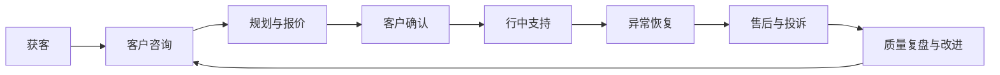
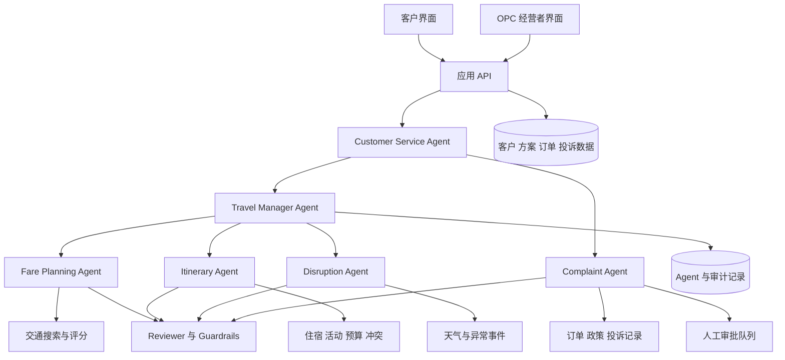
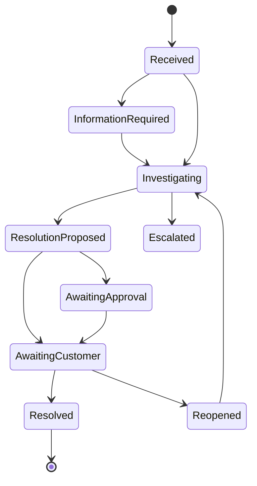

# TripMate AI

[English](README.md) | [简体中文](README.zh-CN.md)

> 一次由专业 Agent、确定性工具和人工监督共同支持的 AI 原生一人旅行公司的可行性验证。

## 项目状态

TripMate AI 当前处于 ELEC5620 项目的**需求分析、商业验证和架构设计阶段**，仓库中暂时没有可运行的原型。本文档描述已经确定的产品方向、MVP 范围、公司运营模式、计划架构、评估方法和后续开发方向；计划中的功能不代表已经完成。

按照课程允许的应用领域，TripMate AI 归类为专注旅行服务的 **Smart Personal Assistant（智能个人助理）**。更准确地说，它是一次 **LLM 驱动的多 Agent OPC（一人公司）可行性原型开发**，而不只是旅行推荐应用。

## 项目愿景

TripMate AI 要验证一个现实问题：

**一名人类经营者能否借助多个专业 AI Agent，运营一家可信赖的旅行服务公司？**

项目目标不是再做一个生成行程的聊天机器人，而是把 TripMate AI 当作一家真实公司：它需要发现并理解客户、可靠地提供服务、在计划失败时及时处理、管理投诉、控制成本、保护数据，并知道什么时候必须由人类承担责任。

人类经营者始终对公司负责。AI Agent 充当虚拟部门，但不能独立执行真实订票、付款、退款、法律决定或安全关键操作。

## 与 ELEC5620 课程要求的对应关系

仓库内容以课程正式项目描述为约束组织。

| 课程要求 | TripMate AI 的对应设计 | 计划提供的证据 |
| --- | --- | --- |
| One-Person AI Company | 一名人类经营者监督由专业 Agent 组成的虚拟旅行公司。 | OPC 运营模型、经营者界面、审批队列和工作量指标。 |
| LLM 多智能体系统 | Agent 承担不同公司职位并通过受控分工协作。 | Agent 定义、编排 Trace、协作图和时序图。 |
| 规划和决策 | Travel Manager 拆分请求，专业 Agent 生成和修改经过检查的方案。 | 活动图、时序图和端到端业务场景。 |
| 使用外部工具 | Agent 调用交通、天气、预算、冲突、订单和政策工具。 | 结构化工具接口、集成测试和执行日志。 |
| 根据结果调整行动 | 工具失败、天气变化、客户修改和投诉会触发重新规划或升级。 | 状态机、失败场景、方案版本和投诉流程。 |
| 模型驱动的软件工程 | 需求、架构、行为、实现、测试和验收证据保持可追踪。 | Stage 1 报告、UML/模型集、追踪矩阵和 Stage 2 原型。 |
| Agile 小组开发 | 三名成员通过共享 Backlog、短 Sprint、Review 和 Retrospective 协作。 | GitHub Issues/Projects、Sprint 记录、Commit、PR Review 和贡献日志。 |
| 先进技术 | 结合 LLM 编排、工具调用、Guardrail、结构化输出、Tracing 和可选 RAG。 | 原型实现和技术评估。 |

### 课程交付物

- **Stage 1 — 30 分：** 正式需求/架构/建模报告（15 分），以及 Presentation 和 Interview（15 分）。
- **Stage 2 — 20 分：** 基于架构设计的概念验证原型和面向 Tutor 的演示。
- Stage 1 文档必须明确写出每位小组成员的贡献。
- Stage 2 源代码需在最后一周周一之前提交至 Canvas，演示在最后一周进行。
- Canvas 日期确认后，小组将在 Agile 计划中补充准确的内部截止日期。

## 真实用户痛点

| 用户痛点 | 现有方案的问题 | TripMate AI 的解决方式 |
| --- | --- | --- |
| 旅行信息分散 | 用户需要在多个网站比较交通、酒店、活动、天气和预算。 | 生成满足限制的一体化方案，并解释各项取舍。 |
| 每个人对“最佳”的定义不同 | 最便宜、最快和最舒适的方案通常不是同一个。 | 提供舒适、性价比和穷游模式，使用透明且可配置的评分。 |
| 隐性限制容易遗漏 | 行李、无障碍、到达时间、中转和活动时间都可能使方案无效。 | 排序前应用硬性限制，并用确定性工具检查预算和时间冲突。 |
| 旅行方案很快失效 | 天气、取消、涨价和场馆关闭都会破坏原计划。 | 识别受影响项目、生成替代方案并保存可审计的版本。 |
| 自动客服缺少责任闭环 | 出现问题后，客户常收到模板回复，还要反复说明情况。 | 将投诉与订单、证据、政策、Agent 记录和人工升级流程关联。 |
| 用户无法判断 AI 信息是否可信 | 生成式系统可能编造价格、库存和政策。 | 将 LLM 推理与可靠数据工具分离，显示来源和时间，并拒绝无依据回答。 |

## 目标用户与初始市场

MVP 面向规划澳洲境内短途旅行的个人用户，首个支持场景为悉尼到墨尔本，使用模拟的交通、住宿、活动和异常数据。

初始用户包括：

- 注重预算的学生和独自旅行者。
- 希望快速比较有效方案、时间有限的旅行者。
- 行程变化后需要明确解决路径的客户。
- 需要管理工作量、审批高风险操作并查看执行记录的一人公司经营者。

## 价值主张与 OPC 可行性

对客户而言，TripMate AI 提供统一的规划、比较、修改和问题解决入口。对经营者而言，它自动完成重复的研究和客服工作，同时把财务、法律和高风险决定保留给人类。

只有满足以下条件，OPC 假设才算初步可行：

- 一名经营者能够同时监督多个客户旅程。
- 常规规划和支持任务达到可接受质量。
- 异常任务按优先级进入人工队列，不会压垮经营者。
- 推荐能够追溯到数据和业务规则。
- 模型/API 成本与人工处理时间不超过服务价值。
- 客户拥有纠错、投诉和请求人工复核的明确路径。

## 公司运营闭环



课程原型重点实现客户咨询到售后支持。获客、收费、供应商合同和盈利能力作为业务能力建模与后续验证方向，不在 MVP 中完整实现。

## 多智能体公司结构

| Agent | 虚拟公司角色 | 核心职责 |
| --- | --- | --- |
| Customer Service Agent | 客服前台 | 识别意图、收集缺失信息、回答普通问题，并将请求转到规划或投诉流程。 |
| Travel Manager Agent | 运营经理 | 管理客户 Case、拆解工作、协调专业 Agent、整合结果和控制服务生命周期。 |
| Fare Planning Agent | 交通专员 | 筛选交通选项、应用旅行模式、排序并解释价格与体验取舍。 |
| Itinerary Agent | 旅行顾问 | 协调住宿、活动、交通时间、客户偏好和预算。 |
| Disruption Agent | 异常恢复专员 | 在天气、延误、取消和关闭事件后识别影响并提出替代方案。 |
| Complaint Agent | 客诉处理专员 | 分类投诉、收集证据、查询政策、提出方案并升级高风险问题。 |
| Reviewer/Guardrail | 质量与合规 | 检查限制、计算、冲突、证据、政策、置信度和操作权限。 |

Travel Manager 负责每个 Case。专业 Agent 不能不受限制地修改订单，所有交接、工具调用、关键决定和审批都会被记录。

## 高层系统架构



### 建议实现技术

- 使用 Python 和 FastAPI 构建应用服务。
- 通过小型技术验证后，只选择一个 Agent 编排框架。
- MVP 使用 Streamlit 构建客户和经营者界面，React 作为后续选项。
- 原型使用 SQLite，后续可迁移到 PostgreSQL。
- 使用 Pydantic 和确定性业务服务进行验证。
- 使用 Pytest 进行单元、集成、场景和回归测试。
- 使用 GitHub Issues/Projects 管理 Agile Backlog 和贡献记录。

## 三种旅行模式

| 评分因素 | 舒适模式 | 性价比模式 | 穷游模式 |
| --- | ---: | ---: | ---: |
| 价格 | 20% | 40% | 65% |
| 行程时间 | 30% | 25% | 15% |
| 舒适度 | 35% | 20% | 5% |
| 可靠性/中转 | 15% | 15% | 15% |

这些是初始可配置权重。最高预算、日期、最晚到达时间、行李、无障碍要求、中转次数、夜间出发、库存和取消状态等硬性限制必须在评分前应用。

```text
score = price_score * Wp
      + duration_score * Wt
      + comfort_score * Wc
      + reliability_score * Wr
```

LLM 负责提取偏好并解释结果，确定性代码负责筛选、计算、冲突检测和排序。推荐结果必须包含备选方案、费用明细、取舍、数据时间以及被排除方案和原因。

## 核心客户流程

### 1. 规划与比较

1. 客户提供路线、日期、预算、旅行模式、偏好和硬性限制。
2. Customer Service 验证需求并询问缺失信息。
3. Travel Manager 创建结构化 Case 并分配研究任务。
4. Fare Planning 筛选并排序交通方案。
5. Itinerary Agent 添加住宿和活动。
6. 预算和时间工具检查方案。
7. Reviewer 检查证据、政策、限制和置信度。
8. 客户收到推荐、备选方案和解释。
9. 客户确认后创建模拟订单和不可覆盖的方案版本。

### 2. 切换偏好模式

客户可在舒适、性价比和穷游之间切换。系统重新计算方案，并展示价格、时间、中转、舒适度、可靠性和受影响活动的差异。

### 3. 异常恢复

系统把天气或取消事件与有效行程匹配，识别受影响项目，生成替代方案，重新执行预算和冲突检查，并让客户选择是否接受新版本。原方案保留，用于审计和投诉调查。

### 4. 客户投诉

Complaint Agent 将投诉关联到订单、对话、报价、数据快照和 Agent 执行记录，判断类别和严重程度，查询公司政策，提出解决方案，并在需要时提交人工审批。



P1 安全问题和 P2 取消/较大金额争议优先进入人工队列。涉及安全、法律威胁、政策不明确、补偿超过阈值、责任判断置信度过低或客户多次拒绝处理结果时，必须人工审批。

## 真实公司挑战与解决思路

| 挑战 | 原型中的处理 | 后续商业化方向 |
| --- | --- | --- |
| 客户信任 | 解释推荐、显示数据时间、保存版本并提供人工复核。 | 供应商级来源、验证评论、服务承诺和透明条款。 |
| 幻觉与错误数据 | 结构化工具、确定性验证、无证据时拒绝回答。 | 多数据源、时效监控和自动数据质量评分。 |
| 供应商/API 故障 | 模拟故障、超时、有限重试、备用数据和降级提示。 | 供应商冗余、熔断、任务队列和 SLA。 |
| 一人公司客服过载 | 严重度分类、优先队列、置信度阈值和常规自动回复。 | 工作量预测、SLA 提醒和临时人工协作机制。 |
| 隐私与安全 | 最小化数据、密钥隔离、日志脱敏和经营者权限控制。 | 加密、保留/删除机制、安全审查、授权管理和事故响应。 |
| 法律与财务责任 | 明确原型免责声明，不执行真实预订或退款。 | 法域审查、服务条款、保险、许可证和专业意见。 |
| 服务质量漂移 | 固定测试场景、Trace 审核、客户反馈和 Prompt/版本追踪。 | 持续评估、回归面板、模型路由和发布门禁。 |
| 单位经济性 | 记录模型调用、延迟、工具成本和人工处理时间。 | 定价实验、缓存、小模型路由和客户终身价值分析。 |
| 客户获取 | 明确目标 Persona 和价值主张。 | 落地页实验、推荐机制、合作渠道、SEO 和获客成本评估。 |
| 业务连续性 | 人工接管和可导出的 Case 记录。 | 备份、监控、灾难恢复和标准操作流程。 |

## 功能需求

| 编号 | 需求 |
| --- | --- |
| FR-01 | 从自然语言中收集并验证结构化旅行需求。 |
| FR-02 | 支持舒适、性价比和穷游模式。 |
| FR-03 | 在方案评分前应用硬性限制。 |
| FR-04 | 生成交通、住宿、活动和预算方案。 |
| FR-05 | 解释推荐、备选方案、取舍和排除原因。 |
| FR-06 | 通过确定性工具计算费用和检测时间冲突。 |
| FR-07 | 支持修改需求和比较不同行程版本。 |
| FR-08 | 检测异常影响并提出经过检查的替代方案。 |
| FR-09 | 创建、分类、调查、升级和追踪投诉。 |
| FR-10 | 处理投诉前查询订单证据和公司政策。 |
| FR-11 | 对高风险操作强制要求人工审批。 |
| FR-12 | 记录 Agent 交接、工具调用、决定、置信度和结果。 |
| FR-13 | 为经营者提供按优先级排列的 Case 和审批界面。 |
| FR-14 | 收集客户反馈并关联到实际交付的服务。 |

## 需求分类

Stage 1 报告将维护带版本的需求目录，不把所有想法都当成已经承诺实现的功能。

### 已达成一致的基线

- TripMate AI 属于 Smart Personal Assistant，是多 Agent OPC 可行性原型。
- 一名人类经营者保留最终责任并处理异常/高风险 Case。
- MVP 使用模拟数据和操作，不执行真实订票、支付或退款。
- 首条端到端 Case 为澳洲境内个人短途旅行。
- 对正确性敏感的 LLM 输出必须由确定性工具和 Guardrail 检查。

### Mandatory：必须实现

- 不同商业角色的 Agent 能协作、调用工具并根据结果调整行动。
- 客户需求收集、三种模式、方案生成、比较和解释。
- 确定性的预算、限制条件和时间冲突验证。
- 异常触发的重新规划和可审计的行程版本。
- 投诉分类、调查、解决和人工升级。
- 经营者审批、Agent/工具 Trace 和可测试的验收标准。
- Stage 1 模型与 Stage 2 实现之间的可追踪关系。

### Optional：可选功能

- 用于目的地、供应商和政策知识的 RAG。
- 真实天气或旅行数据接口。
- 多语言/语音、移动端、地图显示和主动通知。
- 长期偏好记忆、运营分析、供应商评分和商业实验。

只有 Mandatory 验收测试全部通过后，Optional 功能才能进入 MVP。

## 非功能需求

- **正确性：** 金额、时间、限制和政策规则由确定性服务处理。
- **可解释性：** 重要输出包含证据、原因和限制说明。
- **安全性：** Agent 不能执行真实财务交易或绕过审批。
- **隐私：** 最小化收集数据，密钥和个人信息不能进入公开日志。
- **可靠性：** 工具失败后进行有限重试、降级或明确报告错误。
- **可维护性：** Agent、工具、Prompt、业务规则、数据和界面保持模块化。
- **可追踪性：** 需求映射到模型、组件、测试和演示场景。
- **可用性：** 客户能够理解、比较、纠错、投诉并请求人工复核。
- **可运营性：** 一名经营者能看到优先级、故障、成本和待处理决定。

## LLM 在系统中的作用

原型需要明确展示课程要求的三类 LLM 能力：

| 能力 | LLM 的作用 | 非 LLM 控制措施 |
| --- | --- | --- |
| 感知 | 理解自由文本目标、偏好、投诉和异常描述，发现缺失信息。 | Pydantic/Schema 验证、可信数据接口和输入 Guardrail。 |
| 决策 | 拆解 Case、选择 Agent/工具、比较取舍、提出重新规划或投诉方案。 | 硬性限制、评分函数、政策规则、置信度阈值和人工审批。 |
| 交互 | 提出澄清问题，解释方案、变化、限制和投诉结果。 | 审批模板、来源/时间显示、审计日志和输出 Guardrail。 |

测试需要包含 LLM 应主动澄清、调用工具、拒绝编造不可用数据、根据新证据修改方案，以及放弃自动处理并升级给人工的情况。

## 设计假设

- 第一版只支持配置好的澳洲路线和模拟库存。
- 供应商、天气和订单数据来自模拟器或受控 API。
- 价格和库存只是数据快照，不构成商业报价。
- 每个请求代表一名旅客和一个有效行程。
- 用户提供真实需求，并可在确认前纠正系统提取的信息。
- 网络、模型和工具都可能失败；系统必须显示失败而不能编造结果。
- 演示期间，人类经营者能够处理队列中的高风险决定。
- Tutor 作为利益相关者参与需求最终确定和验收。

每项假设都将在 Stage 1 中分配编号，并在需求或外部依赖变化时重新检查。

## 设计理由与备选方案

| 决定 | 选择的方案 | 考虑/放弃的方案 | 理由 |
| --- | --- | --- | --- |
| Agent 控制 | Manager 主导编排，专业 Agent 作为工具或受控交接。 | 所有 Agent 自由群聊。 | 责任清楚、Trace 可预测、容易测试且成本更低。 |
| 正确性 | LLM 配合确定性领域服务。 | 让 LLM 完成所有计算和排序。 | 金额、限制和政策需要可复现的结果。 |
| 交易范围 | 模拟操作与人工审批。 | MVP 直接连接真实支付/订票。 | 降低法律、财务、安全和集成风险。 |
| 数据范围 | 小型受控澳洲数据集。 | 全球实时旅行市场。 | 适合三人课程项目并支持有效评估。 |
| 界面 | Streamlit MVP，区分客户和经营者视图。 | 一开始开发完整移动端和 React 平台。 | 将精力集中在 Agent 行为、建模和评估。 |
| 人类角色 | 按风险进行 Human-in-the-loop。 | 完全自主 OPC。 | 真实公司需要对异常和高影响决定负责。 |

未采用的方案也会保留记录，因为 Stage 1 Presentation 需要解释选择和放弃方案的原因。

## 模型清单与可追踪性

Stage 1 计划包含：

- User Requirement Diagram 和 Feature Diagram。
- Use Case Diagram 以及主要用例的详细交互步骤。
- Package、Class、Structured Class 和 Collaboration Diagram。
- 旅行规划、异常恢复和投诉处理 Activity Diagram。
- Travel Request/Order 和 Complaint State Machine。
- 规划、重新规划、投诉处理和人工审批 Sequence Diagram。
- 关键组件关系，以及未来 Agent、工具、数据源和界面的扩展点。
- “需求 → 用例/模型 → 组件 → 测试 → 验收证据”追踪矩阵。

README 中的图只用于高层说明，不能代替 Stage 1 的正式系统模型。

## 变更评估与验收

每项重要变更都通过 GitHub Issue 管理，Issue 中记录受影响的需求编号、理由、优先级、架构/模型影响、测试影响、负责人和验收条件。

变更只有满足以下条件才能被接受：

1. Mandatory 需求和安全控制仍然通过。
2. 相关图和可追踪关系已经更新。
3. 单元/集成/场景测试提供新行为证据。
4. 产品负责人/经营者和相关 Team Reviewer 同意结果。
5. 性能、模型成本、经营者工作量、隐私和新增风险仍可接受。

Tutor 反馈导致需求改变时，必须更新需求基线版本，不能只悄悄修改代码。

## MVP 边界

### 包含

- 有限路线的澳洲境内短途旅行。
- 模拟交通、住宿、活动、订单、退款和政策数据。
- 每次请求一名旅客，以及一条连续的端到端演示故事。
- 规划、比较、重新规划、投诉和人工审批。
- 客户/经营者界面及可审计的 Agent 记录。

### 不包含

- 真实订票、支付、退款、补偿或供应商合同。
- 国际签证、法律、医疗、保险或安全建议。
- 对实时价格或库存的保证。
- 复杂团体旅行和完全自主的高风险决定。

## 核心数据实体

Customer、TravelRequest、TransportOption、AccommodationOption、Activity、ItineraryVersion、SimulatedOrder、DisruptionEvent、Complaint、CompanyPolicy、HumanApproval、CustomerFeedback、AgentExecutionLog 和 CostRecord。

## 评估方案

### 用户价值指标

- 硬性限制满足率和有效方案完成率。
- 用户获得可接受方案所需时间与操作次数。
- 用户测试中的接受率、修改率和满意度。
- 投诉处理结果的清晰度与公平感。

### OPC 可行性指标

- 无需经营者介入即可完成的 Case 比例。
- 每个规划 Case 和投诉消耗的人工分钟数。
- 人工审批队列的数量和等待时间。
- 每个成功 Case 的模型与工具成本。
- 因正确原因而升级的 Case 比例。

### 技术与安全指标

| 指标 | 初始目标 |
| --- | ---: |
| 硬性限制满足率 | ≥ 95% |
| 预算计算准确率 | 100% |
| 测试集冲突检测率 | 100% |
| 投诉分流准确率 | ≥ 90% |
| 高风险投诉升级率 | 100% |
| 未授权执行真实/模拟退款 | 0 次 |
| 端到端任务完成率 | ≥ 85% |

测试包括单元测试、Agent/工具集成测试、端到端业务场景、工具/API 故障、冲突需求、无库存、Prompt Injection、绕过政策尝试，以及有限的单 Agent 与多 Agent 对比。

## 开发路线图

### Phase 0：用户与商业验证

- 访谈潜在旅行用户，识别成本最高的规划和客服问题。
- 确定 Persona、客户旅程、服务承诺、失败政策和 OPC 可行性假设。
- 聚焦一条连续业务场景，避免尝试实现完整订票平台。

### Phase 1：需求与系统建模

- 确定功能/非功能需求、假设、验收标准和可追踪性。
- 完成用户需求、特性、用例、包、类、活动、状态机、时序、结构类和协作模型。
- 同时建模客户旅程和经营者工作流。

### Phase 2：旅行规划 MVP

- 实现结构化需求收集、Travel Manager、Fare Planning、模拟交通数据、硬性限制、三种模式、备选方案和解释。

### Phase 3：完整服务

- 加入行程、住宿/活动、预算/冲突工具、方案版本、模拟订单、Reviewer 检查和经营者 Trace 界面。

### Phase 4：异常与投诉

- 加入天气/异常事件、影响分析、重新规划、投诉状态、政策查询、优先队列和人工审批。

### Phase 5：评估与演示

- 执行正常、失败、对抗性、用户价值和 OPC 工作量场景。
- 测量质量、完成率、延迟、成本、升级和人工工作量。
- 确保实现与 Stage 1 模型一致并准备最终演示。

### 贯穿所有阶段的 Agile 证据

- 带需求编号和验收条件的优先级 Product Backlog。
- Sprint Goal、任务负责人、估算和 Definition of Done。
- 简短 Stand-up 记录、Review 结果和 Retrospective 改进行动。
- Feature Branch、聚焦的 Commit、Peer Review 和关联测试。
- 架构变更与放弃方案的 Decision Log。
- 由 Issue、模型、代码、测试、Review 和 Presentation 组成的成员贡献日志。

### 后续开发方向

- 真实交通、住宿、地图、日历和通知接口。
- 为目的地、供应商条款和公司政策加入 RAG。
- PostgreSQL、后台任务、事件、监控、备份和灾难恢复。
- 多城市/团体旅行、多语言、语音和移动端。
- 基于授权的客户记忆和偏好可迁移机制。
- 需求、投诉、SLA、质量和单位经济性运营面板。
- 自动评估集、模型路由、缓存和回归发布门禁。
- 供应商可靠性评分、异常预测和主动客户支持。
- 定价、获客渠道、合作伙伴和留存率的商业实验。

## 计划中的仓库结构

```text
.
├── README.md
├── README.zh-CN.md
├── docs/{business,requirements,architecture,models,agile}/
├── src/{agents,api,domain,tools,guardrails,data,ui}/
├── tests/{unit,integration,scenarios,evaluation}/
├── data/{transport,accommodation,activities,policies}/
└── pyproject.toml
```

## 三人小组分工

| 工作方向 | 主要负责人 | 工作内容 |
| --- | --- | --- |
| 客户运营 | 成员 A | Customer Service、Complaint Agent、客户/经营者界面、投诉状态和用户测试。 |
| 规划与交通 | 成员 B | Travel Manager、Fare Planning、评分模式、交通/预算工具和 Agent 编排。 |
| 行程与质量 | 成员 C | Itinerary/Disruption Agent、事件数据、Reviewer、Trace、评估和系统测试。 |

架构决定、系统集成、商业验证、报告审核、展示和演示由三人共同负责。通过 Issue、Commit、Review、模型和测试记录个人贡献。

Stage 1 提交前，以下占位内容必须替换成真实姓名和经确认的贡献：

| 成员 | 需求/模型 | 实现/测试 | Presentation/运营 | 证据链接 |
| --- | --- | --- | --- | --- |
| 成员 A — TBD | 客户与投诉需求和模型 | Customer Service、Complaint、界面、用户测试 | 客户旅程与投诉演示 | Issue/Commit/模型 — TBD |
| 成员 B — TBD | 规划与编排需求和模型 | Manager、Fare Planning、评分/工具 | 架构与旅行模式演示 | Issue/Commit/模型 — TBD |
| 成员 C — TBD | 行程、异常和质量需求和模型 | Itinerary、Disruption、Reviewer、评估 | 测试、Agile 证据和异常演示 | Issue/Commit/模型 — TBD |

## 建议演示故事

1. 客户要求生成悉尼到墨尔本的旅行方案并选择性价比模式。
2. 系统生成经过检查的行程，并解释证据与取舍。
3. 客户切换到舒适模式并比较新旧版本。
4. 模拟天气事件导致室外活动取消。
5. 系统提出符合限制的替代方案并说明费用变化。
6. 客户认为替代活动价值较低并提出投诉。
7. Complaint Agent 查询订单、原始证据、Trace 和公司政策。
8. 建议退款进入经营者审批队列。
9. 经营者作出决定，Customer Service 解释结果并记录反馈。

该故事集中展示用户价值、公司运营、LLM 感知、多 Agent 分工、确定性工具、动态调整、投诉处理和人类责任。

## 贡献规范

- 每项重要修改创建或关联 GitHub Issue。
- 每个功能分支只处理一个需求或组件。
- 行为变化时同步更新测试和模型。
- 合并前进行 Review 并保存验收证据。
- 不提交 API 密钥、真实客户数据或支付信息。

## 课程与法律说明

TripMate AI 是 ELEC5620 Group 6 的教学概念验证项目，不是商业预订服务，也不能用于真实旅行、财务、法律、医疗、移民或安全决定。

项目尚未选择许可证。在添加许可证之前，所有权利由仓库所有者保留。
