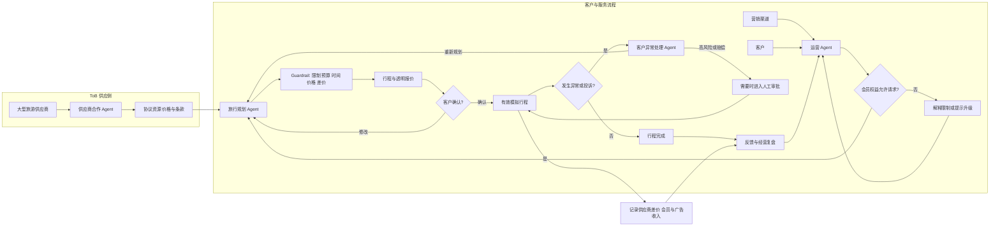
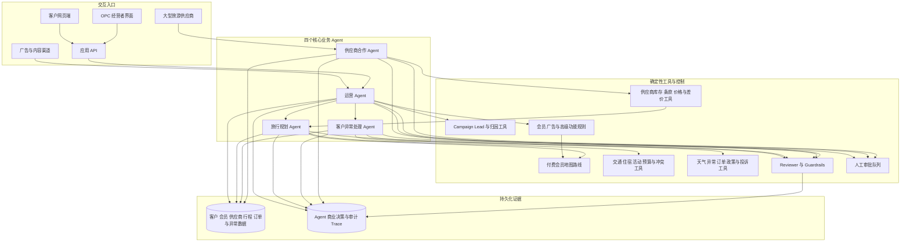
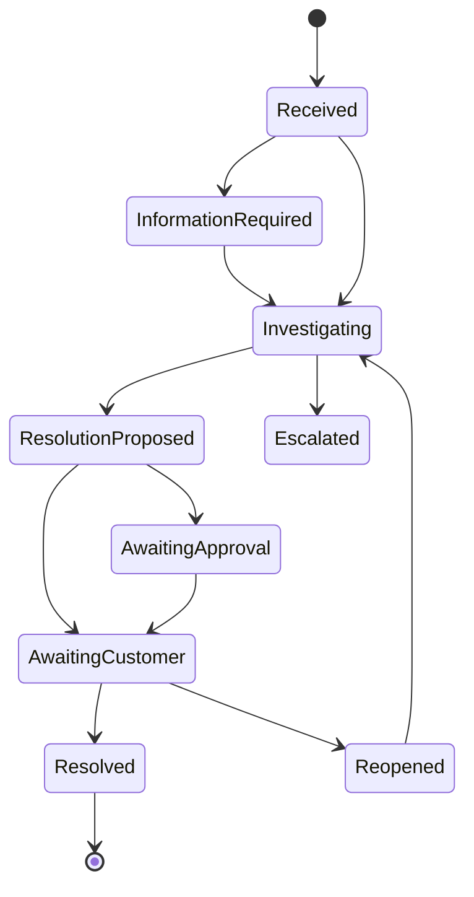
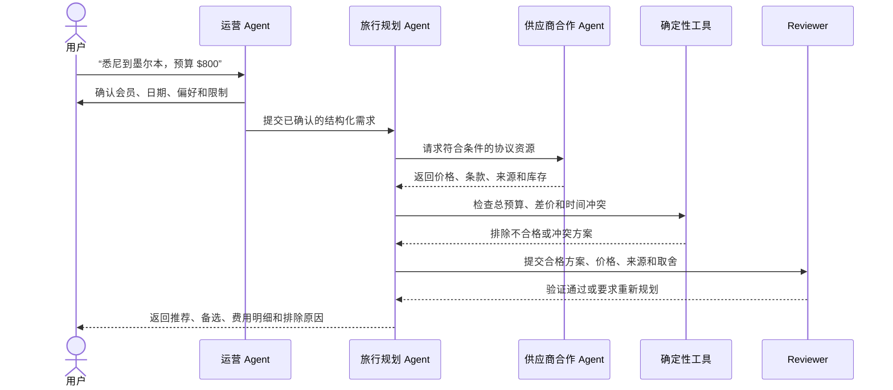

# TripMate AI

[English](README.md) | [简体中文](README.zh-CN.md)

> 一次由专业 Agent、确定性工具和人工监督共同支持的 AI 原生一人旅行公司的可行性验证。

## 项目状态

TripMate AI 当前处于 ELEC5620 项目的**需求分析、商业验证和架构设计阶段**，仓库中暂时没有可运行的原型。本文档描述已经确定的产品方向、MVP 范围、公司运营模式、计划架构、评估方法和后续开发方向；计划中的功能不代表已经完成。

项目分两次提交：**Stage 1 截止于 2026 年 9 月 24 日**，**Stage 2 截止于 2026 年 11 月 5 日**。当前优先完成 Stage 1；Stage 2 的详细要求尚未发布。

按照课程允许的应用领域，TripMate AI 归类为专注旅行服务的 **Smart Personal Assistant（智能个人助理）**。更准确地说，它是一次 **LLM 驱动的多 Agent OPC（一人公司）可行性原型开发**，而不只是旅行推荐应用。

## 项目愿景

TripMate AI 要验证一个现实问题：

**一名人类经营者能否借助多个专业 AI Agent，运营一家可信赖的旅行服务公司？**

项目目标不是再做一个生成行程的聊天机器人，而是把 TripMate AI 当作一家真实公司：它需要发现并理解客户、可靠地提供服务、在计划失败时及时处理、管理投诉、控制成本、保护数据，并知道什么时候必须由人类承担责任。

人类经营者始终对公司负责。AI Agent 充当虚拟部门，但不能独立执行真实订票、付款、退款、法律决定或安全关键操作。

## 与 ELEC5620 课程要求的对应关系

仓库内容以课程正式项目描述为约束组织。

| 课程要求 | TripMate AI 的对应设计 | 计划提供的证据 |
| --- | --- | --- |
| One-Person AI Company | 一名人类经营者监督由专业 Agent 组成的虚拟旅行公司。 | OPC 运营模型、经营者界面、审批队列和工作量指标。 |
| LLM 多智能体系统 | Agent 承担不同公司职位并通过受控分工协作。 | Agent 定义、编排 Trace、协作图和时序图。 |
| 规划和决策 | 运营 Agent 分流请求，旅行规划 Agent 生成和修改经过检查的完整方案。 | 活动图、时序图和端到端业务场景。 |
| 使用外部工具 | Agent 调用交通、天气、预算、冲突、订单和政策工具。 | 结构化工具接口、集成测试和执行日志。 |
| 根据结果调整行动 | 工具失败、天气变化、客户修改和投诉会触发重新规划或升级。 | 状态机、失败场景、方案版本和投诉流程。 |
| 模型驱动的软件工程 | 需求、架构、行为、实现、测试和验收证据保持可追踪。 | Stage 1 报告、UML/模型集、追踪矩阵和 Stage 2 原型。 |
| Agile 小组开发 | 四名成员通过共享 Backlog、短 Sprint、Review 和 Retrospective 协作。 | GitHub Issues/Projects、Sprint 记录、Commit、PR Review 和贡献日志。 |
| 先进技术 | 结合 LLM 编排、工具调用、Guardrail、结构化输出、Tracing 和可选 RAG。 | 原型实现和技术评估。 |

### 提交阶段与产出成果

课程成果分为以下两次提交：

| 阶段 | 截止日期 | 主要产出与证明材料 |
| --- | --- | --- |
| **Stage 1 — 需求、架构与系统建模（30 分）** | **2026 年 9 月 24 日** | 面向 Tutor 介绍项目：说明 Project Description、目标用户、One-Person AI Company 概念、Agent 角色、需求分类、关键 Use Case、系统架构、设计理由及主要设计图/UML 模型。配套提交内容以 [`docs/`](docs/) 中的文件为准，包括需求与建模报告（15 分）、不超过 8 分钟的视频 Presentation（5 分）和个人 Interview（10 分）。文档中必须清楚标明每位成员的贡献。 |
| **Stage 2 — 原型实现与演示（20 分）** | **2026 年 11 月 5 日** | 完成与 Stage 1 架构一致的概念验证原型，用代码实现核心 Agent、Agent 之间的协作及工具调用流程，并形成可向 Tutor 展示的端到端运行效果。目前倾向使用小型网页作为交互和展示载体，初步优先考虑 Streamlit，方便开发、运行和现场演示。Stage 2 的详细提交内容及最终展示形式仍待课程发布。 |

Stage 1 的实际准备重点是形成一套简洁、适合向 Tutor 讲解的项目叙事和清晰的设计图，同时保证需求与模型前后一致。预计模型包括 Feature Diagram、Use Case Diagram、Class Diagram、复杂结构模型、Activity Diagram、Interaction/Sequence Diagram、State Machine，以及可追踪到个人贡献的说明。

Stage 2 的当前计划属于暂定方案，正式要求发布后再更新。原型代码应能展示 LLM Agent 如何理解请求、进行决策、协作、调用工具，并根据执行结果调整行动，同时保留小组使用 Agile 开发过程的证据。

参考文件：[Project Description](docs/Project%20Description.pdf)、[Stage 1 Marking Criteria](docs/ELEC5620_Project_Stage_1_Marking_Criteria.pdf) 和 [Project Requirement Example](docs/Project_Requirement_Example.pdf)。

## 真实用户痛点

| 用户痛点 | 现有方案的问题 | TripMate AI 的解决方式 |
| --- | --- | --- |
| 旅行信息分散 | 用户需要在多个网站比较交通、酒店、活动、天气和预算。 | 生成满足限制的一体化方案，并解释各项取舍。 |
| 每个人对“最佳”的定义不同 | 最便宜、最快和最舒适的方案通常不是同一个。 | 提供舒适、性价比和穷游模式，使用透明且可配置的评分。 |
| 隐性限制容易遗漏 | 行李、无障碍、到达时间、中转和活动时间都可能使方案无效。 | 排序前应用硬性限制，并用确定性工具检查预算和时间冲突。 |
| 旅行方案很快失效 | 天气、取消、涨价和场馆关闭都会破坏原计划。 | 识别受影响项目、生成替代方案并保存可审计的版本。 |
| 自动客服缺少责任闭环 | 出现问题后，客户常收到模板回复，还要反复说明情况。 | 将投诉与订单、证据、政策、Agent 记录和人工升级流程关联。 |
| 用户无法判断 AI 信息是否可信 | 生成式系统可能编造价格、库存和政策。 | 将 LLM 推理与可靠数据工具分离，显示来源和时间，并拒绝无依据回答。 |

## 目标用户与初始市场

MVP 面向规划澳洲境内短途旅行的个人用户，首个支持场景为悉尼到墨尔本，使用模拟的交通、住宿、活动和异常数据。

初始用户包括：

- 注重预算的学生和独自旅行者。
- 希望快速比较有效方案、时间有限的旅行者。
- 行程变化后需要明确解决路径的客户。
- 需要管理工作量、审批高风险操作并查看执行记录的一人公司经营者。
- 能够以协议价或批发价提供旅行资源的大型旅游供应商。

## 价值主张与 OPC 可行性

对客户而言，TripMate AI 提供统一的规划、比较、修改和问题解决入口。对经营者而言，它自动完成重复的研究和客服工作，同时把财务、法律和高风险决定保留给人类。

只有满足以下条件，OPC 假设才算初步可行：

- 一名经营者能够同时监督多个客户旅程。
- 常规规划和支持任务达到可接受质量。
- 异常任务按优先级进入人工队列，不会压垮经营者。
- 推荐能够追溯到数据和业务规则。
- 模型/API 成本与人工处理时间不超过服务价值。
- 客户拥有纠错、投诉和请求人工复核的明确路径。

## 盈利模式与会员制度

TripMate AI 不应只验证 Agent 功能，还需要验证公司能否产生收入。当前商业模式由三类互补收入组成：

1. **旅游资源差价：** Supplier Partnership Agent（供应商合作 Agent）对接大型旅游商，以协议价或批发价获取交通、住宿和活动资源。TripMate AI 向客户展示最终售价，并赚取明确记录的差价或佣金。课程原型只使用模拟合同和价格，不签署真实合同，也不执行真实订票。
2. **付费会员订阅：** 付费用户通过周期性订阅获得无广告体验、不受免费版同时规划数量和行程天数限制、地图路线展示及其他高级规划功能。
3. **免费用户广告：** 免费会员界面可以出现清楚标注的广告，但广告不得改变硬性限制筛选，也不得暗中影响推荐排序。

| 权益 | 免费会员 | 付费会员 |
| --- | --- | --- |
| 同时处于规划中或进行中的旅行 | 最多 **2 条** | 不受免费版数量限制 |
| 单条行程最长时间 | 最多 **5 天** | 不受免费版天数限制 |
| 广告 | 可以显示明确标注的广告 | 无广告 |
| 核心规划与异常重规划 | 包含 | 包含 |
| 地图路线与高级规划功能 | 不包含 | 包含 |

系统在创建新行程或延长行程前，通过确定性的会员权限规则检查限制。达到上限时不得删除已有数据，而应解释限制，并允许用户结束现有行程、缩短新行程或升级会员。

## 公司运营闭环



课程原型覆盖获客到售后支持，并增加模拟商业闭环：系统以供应商基础价格取得资源，将其组合为合格行程，以客户价格提供，并记录公司差价。运营 Agent 可以分析目标客群、生成广告素材、负责客服前台并汇总 Campaign 效果，但真实发布和支出仍需经营者审批。会员收费、供应商合同、订票和支付均只做模拟。

## 多智能体公司结构

| Agent | 虚拟公司角色 | 核心职责 |
| --- | --- | --- |
| Operations Agent（运营 Agent） | 获客、营销与客服前台 | 定义受众与 Campaign、生成经审批的营销内容、追踪 Lead、接待客户、识别意图、补充缺失信息、回答常规问题、检查会员权益并将任务分配给对应 Agent。 |
| Travel Planning Agent（旅行规划 Agent） | 端到端旅行规划 | 搜索并组合交通、住宿和活动，应用旅行模式与硬性限制，生成、排序、解释和修改完整行程。 |
| Customer Exception Agent（客户异常处理 Agent） | 旅行异常与投诉处理 | 接收旅行异常，识别受影响的行程项目，生成恢复方案；结合证据与政策调查投诉，并升级高风险或低置信度 Case。 |
| Supplier Partnership Agent（供应商合作 Agent） | ToB 资源采购与商业合作 | 对接大型旅游商，导入模拟协议资源与条款，比较供应商价格，追踪库存和可靠性，并在不隐藏客户售价的前提下计算公司差价。 |
| Reviewer/Guardrail | 质量与合规 | 检查限制、计算、冲突、证据、政策、置信度和操作权限。 |

运营 Agent 负责客户关系和 Case 分流；旅行规划 Agent 负责生成有效行程；客户异常处理 Agent 负责旅行异常和投诉；供应商合作 Agent 负责供应商资源与差价证据。Reviewer/Guardrail 是横向质量控制组件，不是面向客户的业务部门。任何 Agent 都不能越权签署真实供应商合同、发布广告、花费预算、修改订单或发放赔偿。所有交接、工具调用、商业计算、关键决定和审批都会被记录。

## 高层系统架构



运营 Agent 只在模拟数据上自动执行 Campaign 规划和效果分析，供应商合作 Agent 也只使用模拟供应商目录、价格和协议。任何真实广告发布、外部消息、供应商承诺或预算支出都进入人工审批队列。

### 建议实现技术

- 使用 Python 和 FastAPI 构建应用服务。
- 通过小型技术验证后，只选择一个 Agent 编排框架。
- MVP 使用 Streamlit 构建客户和经营者界面，React 作为后续选项。
- 原型使用 SQLite，后续可迁移到 PostgreSQL。
- 使用 Pydantic 和确定性业务服务进行验证。
- 使用 Pytest 进行单元、集成、场景和回归测试。
- 使用 GitHub Issues/Projects 管理 Agile Backlog 和贡献记录。

## 三种旅行模式

| 评分因素 | 舒适模式 | 性价比模式 | 穷游模式 |
| --- | ---: | ---: | ---: |
| 价格 | 20% | 40% | 65% |
| 行程时间 | 30% | 25% | 15% |
| 舒适度 | 35% | 20% | 5% |
| 可靠性/中转 | 15% | 15% | 15% |

这些是初始可配置权重。最高预算、日期、最晚到达时间、行李、无障碍要求、中转次数、夜间出发、库存和取消状态等硬性限制必须在评分前应用。硬性限制是“合格/不合格”规则，不参与加权，也不能被较高的舒适度、速度或可靠性分数抵消。例如，用户总预算为 $500 时，任何预计总费用超过 $500 的完整方案都必须先被排除，不能进入评分、排序或最终推荐；系统还应记录排除原因和计算明细。

```text
score = price_score * Wp
      + duration_score * Wt
      + comfort_score * Wc
      + reliability_score * Wr
```

LLM 负责提取偏好并解释结果，确定性代码负责筛选、计算、冲突检测和排序。推荐结果必须包含备选方案、费用明细、取舍、数据时间以及被排除方案和原因。

## 核心客户流程

### 1. 规划与比较

1. 客户提供路线、日期、预算、旅行模式、偏好和硬性限制。
2. 运营 Agent 验证需求、会员权益和缺失信息。
3. 旅行规划 Agent 创建结构化 Case，并取得符合条件的供应商资源。
4. 旅行规划 Agent 将交通、住宿和活动组合为完整行程并排序。
5. 预算、时间、会员权限和差价工具检查方案。
6. Reviewer 检查证据、政策、限制、价格透明度和置信度。
7. 客户收到推荐、备选方案和解释。
8. 客户确认后创建模拟订单和不可覆盖的方案版本。

**备选/异常流程：** 信息不完整时暂停规划并询问用户；没有任何候选方案满足硬性限制时，不返回“最接近”的违规方案，而是说明无解、列出造成无解的限制，并请求用户明确放宽某项条件；工具超时或数据过期时标记失败或降级，不允许 LLM 猜测价格与库存。

### 2. 切换偏好模式

客户可在舒适、性价比和穷游之间切换。系统重新计算方案，并展示价格、时间、中转、舒适度、可靠性和受影响活动的差异。

### 3. 异常恢复

TripMate AI 不是只在出发前生成一次方案的“一锤子买卖”。在有效旅行期间，用户每天都可以随时调取 AI 检查当天及后续路线。系统重新获取带时间戳的交通、天气、罢工、道路/铁路中断和场馆状态，把新事件与有效行程匹配，识别受影响项目，生成替代方案，重新执行预算和冲突检查，并让客户选择是否接受新版本。原方案和一个月前使用的数据快照仍会保留，用于版本比较、审计和投诉调查。

系统既支持用户主动发起复查，也支持模拟事件触发复查；但不会在未经用户确认的情况下覆盖有效行程或执行真实改签。若最新数据不可用，系统必须显示“无法验证”，不能把旧信息包装成实时状态。

### 4. 旅行异常与客户投诉

客户异常处理 Agent 同时负责旅行异常与投诉，使恢复决定和后续调查共用同一套证据。它将 Case 关联到订单、对话、报价、供应商条款、数据快照、行程版本和 Agent 执行记录，判断严重程度，提出恢复或解决方案，并在需要时提交人工审批。



P1 安全问题和 P2 取消/较大金额争议优先进入人工队列。涉及安全、法律威胁、政策不明确、补偿超过阈值、责任判断置信度过低或客户多次拒绝处理结果时，必须人工审批。

### 5. 获客、营销与客户服务

1. 经营者设置目标（例如获取悉尼出发、预算敏感的学生旅客）、Campaign 上限、允许渠道和禁止表达。
2. 运营 Agent 分析模拟的受众、渠道成本和历史转化数据。
3. Agent 生成广告文案、创意简报、落地页主张、受众分组和预算分配建议。
4. Reviewer 检查事实、品牌规范、隐私、歧视性定向、免责声明和预算上限。
5. 经营者审批、修改或拒绝 Campaign；未经审批不得真实发布或花费预算。
6. 获批的模拟 Campaign 产生带来源标签的 Lead，并由同一个运营 Agent 接续客服前台咨询。
7. Agent 汇总曝光、点击、获客成本、合格线索率和转化率，建议暂停、继续或调整 Campaign。

### 6. 获取供应商资源并计算差价

1. 经营者定义允许的供应商类型、目的地、合同规则、最低证据要求和差价边界。
2. 供应商合作 Agent 从大型旅游商导入模拟价格、库存、取消条款、佣金规则和服务质量数据。
3. Agent 标准化不同供应商的资源，使旅行规划 Agent 可以比较同类项目。
4. 差价工具计算供应商成本、客户售价、佣金或加价、适用费用和预计毛利。
5. Reviewer 检查价格透明度、过期库存、禁止条款和超出批准范围的差价。
6. 真实合同、供应商承诺或定价规则变更必须由经营者审批；课程原型只记录模拟协议。

### 7. 应用会员权益

创建或延长行程前，运营 Agent 检查客户会员状态。免费会员最多同时保留两条规划中或进行中的旅行，每条行程最多五天。免费会员可以看到明确标注的广告，但广告不得覆盖硬性限制或影响推荐分数。付费会员不受免费版旅行数量与天数限制，界面无广告，并可使用地图路线及其他高级规划功能。

### 示例用户使用旅程：悉尼到墨尔本，预算 $800



旅程的预期结果是：运营 Agent 完成需求收集和会员检查，旅行规划 Agent 使用供应商资源生成方案，预算、时间和差价工具进行确定性验证，最终只返回总价不超过 $800、没有时间冲突且价格透明的推荐。如果没有合格方案，系统必须解释原因并征得用户同意后才可调整预算或其他限制。

## 边缘情况运行场景

### EC-01：预算边界过滤

**场景：** 用户设置总预算为 $500，候选方案 A 总价 $480，候选方案 B 总价 $500，候选方案 C 总价 $501。

**运行过程：** 预算工具先计算完整方案总价（交通、住宿、活动和适用费用），再执行 FR-03。A 和 B 可以进入后续评分；C 必须在评分前被排除，并记录 `budget_ceiling_exceeded`、预算上限、实际总价和超出金额 $1。无论 C 的时间或舒适度分数多高，都不能出现在推荐或备选方案中。

**预期结果：** 返回的所有方案均不超过 $500。如果所有候选方案都超过预算，系统返回“无合格方案”，说明最低可行总价，并询问用户是否愿意主动调整预算或其他条件，而不是擅自放宽限制。

### EC-02：行中每日复查与突发重规划

**场景：** 用户一个月前确认的方案推荐当天乘火车出行。旅行当天，用户再次调取 AI 查看路线；最新工具数据表明沿线发生泥石流或铁路罢工，原车次已取消、暂停或无法可靠到达。

**运行过程：**

1. 系统读取当前有效行程、用户原始硬性限制、剩余预算和已完成项目。
2. 工具重新查询当天的铁路运行、道路、航班、天气与安全/中断信息，并显示数据来源和更新时间。
3. 客户异常处理 Agent 判断原火车方案是否仍有效；已取消或不可达的方案立即标记为不可用，不再参与评分。
4. Agent 搜索可行替代方案，例如改乘航班、长途巴士、延后出发或调整当天活动。
5. 确定性工具重新检查增量费用、剩余总预算、到达时间、换乘和活动冲突，然后只对合格方案评分。
6. 系统展示推荐方案、备选方案、与旧版本的差异、额外费用、影响范围及数据时间。
7. 用户确认后才创建新的行程版本；旧版本不被覆盖。若无安全且合规的替代方案，系统明确报告无解并升级人工支持。

**预期结果：** AI 根据当天情况重新规划当前最优方案，而不是重复一个月前已经失效的火车建议。用户可以在旅行期间每天或事件发生后重复执行此流程。

### 其他边缘情况

| ID | 边缘情况 | 系统运行要求 | 禁止行为/验收结果 |
| --- | --- | --- | --- |
| EC-03 | **需求互相矛盾：** 用户要求“总预算 $300、只住五星酒店、当天到达”，但库存中不存在满足全部条件的方案。 | 在搜索前标记潜在矛盾；完成硬性限制筛选后返回无解，并逐项说明导致无解的条件及可选择放宽的影响。 | 不得默默把五星降为三星、提高预算或更改日期；只有用户明确确认后才能修改需求。 |
| EC-04 | **无库存或全部售罄：** 路线存在，但交通或住宿在指定日期无可用库存。 | 返回“无合格库存”和最后查询时间；可搜索相邻日期、邻近车站/机场或候补方案，但将其清楚标记为建议。 | 不得把历史库存、候补或推测的可用性描述为已确认方案。 |
| EC-05 | **价格在确认前变化：** 一个月前方案为 $480，当天复查变为 $530，超过 $500 预算。 | 将价格快照标记为已变化，重新计算完整方案并再次应用 FR-03；超预算旧方案变为不可用，随后搜索合格替代方案。 | 不得沿用旧价格使方案“看起来”合规，也不得未经确认自动提高预算。 |
| EC-06 | **实时数据源失败或互相冲突：** 铁路 API 超时，或两个来源对车次状态给出不同结论。 | 进行有限重试和备用来源查询，显示来源、时间与不确定性；无法验证时停止自动推荐并提供人工支持入口。 | 不得让 LLM 猜测车次正常运行；高影响冲突不能用简单多数投票掩盖。 |
| EC-07 | **时区、夏令时与不可能转乘：** 跨州时间不同，表面上有 20 分钟换乘，换算后实际已错过。 | 所有时间存储为带时区值，以当地时间展示；冲突工具统一换算，并加入步行、取行李、安检和最小换乘缓冲。 | 任何换算后冲突或低于最小缓冲的组合必须被排除。 |
| EC-08 | **行李、无障碍或特殊需求不满足：** 最便宜方案不含所需行李，或车站没有用户要求的无障碍设施。 | 将已确认的行李和无障碍要求视为硬性限制，查询相应证据并在评分前过滤。缺少可靠信息时要求澄清或人工核实。 | 不得用低价或高评分抵消无障碍、健康相关或行李硬性要求。 |
| EC-09 | **行程已经部分完成：** 用户已入住酒店并参加上午活动，下午交通被取消。 | 锁定已完成和不可退项目，只重规划受影响的未来部分；按剩余预算和增量费用检查新方案，并展示沉没成本与新增费用。 | 不得删除已完成记录、重复预订或把全部原始预算当作仍可使用。 |
| EC-10 | **重复通知或用户连续点击：** 同一罢工事件被多次推送，用户也多次请求重规划。 | 使用事件 ID、行程版本和幂等键去重；相同输入和数据快照复用结果，新信息才创建新候选版本。 | 不得产生重复订单、重复审批、重复费用或无限重规划循环。 |
| EC-11 | **危险或紧急情况：** 山火、洪水、泥石流或医疗/人身安全风险影响行程。 | 优先显示官方安全信息和紧急联系方式，停止普通“最优评分”，将安全要求作为最高级硬性限制并升级人工处理。 | 不得把 AI 推荐描述为应急、安全、医疗或官方疏散指令，也不得为了节省费用推荐高风险路线。 |
| EC-12 | **免费会员达到上限：** 已有两条规划中/进行中行程的免费会员申请第三条行程，或将某条行程延长到五天以上。 | 只拒绝新建/延长操作，保留现有行程，解释具体限制，并提供结束现有行程、缩短请求或升级会员的选项。 | 不得删除现有行程、擅自缩短行程或让 LLM 绕过权限规则。 |
| EC-13 | **订阅到期或变更：** 付费会员在保留多条长行程时订阅到期。 | 保留已有行程数据，依据明确的宽限政策限制后续付费操作，不删除历史证据，并提示续费或调整未来请求。 | 不得删除地图或行程历史、在原型中自动扣费，或不通知用户就降低数据权益。 |
| EC-14 | **供应商价格或条款不一致：** 客户报价使用了过期批发价，或供应商取消条款发生变化。 | 重新获取或作废该 Offer，重新计算客户售价和差价，显示变化，并在适用时要求重新确认或审批。 | 不得隐藏负差价/过高差价、沿用无效条款，或把不可用资源描述为可预订。 |

这些边缘情况必须进入场景测试集。每次测试至少验证：是否正确过滤、是否保留旧版本、是否显示数据时间和不确定性、是否避免未经授权的操作，以及是否在无安全解时升级人工处理。

## Use Case 规格

| ID | 用例 | 主要参与者 | 前置条件 | 成功结果 | 关键异常 |
| --- | --- | --- | --- | --- | --- |
| UC-01 | 创建并比较旅行方案 | 旅客、运营 Agent、旅行规划 Agent | 用户能够确认路线、日期与预算；模拟数据可用；会员权益允许该请求 | 返回通过会员权限、硬性限制、预算、差价和冲突检查的推荐及备选方案 | 缺少信息、会员限制、无合格库存、工具失败或需求矛盾 |
| UC-02 | 修改偏好并比较版本 | 旅客、旅行规划 Agent | 已存在一个方案版本 | 生成新版本并显示价格、时间和体验差异，旧版本保持不变 | 新偏好导致无解、超过预算或超出会员限制 |
| UC-03 | 行中复查并处理旅行异常 | 旅客、客户异常处理 Agent、经营者 | 已有有效模拟订单；用户主动复查或系统收到相关事件 | 使用最新数据识别受影响项目并提供重新验证的替代方案 | 实时数据不可用、无替代方案、额外费用过高或涉及安全风险 |
| UC-04 | 调查并解决投诉 | 旅客、客户异常处理 Agent、经营者 | 投诉可关联订单或能够补充必要证据 | 记录有证据的处理结果，必要时完成人工审批 | 政策不明确、法律/安全风险或客户重新开启投诉 |
| UC-05 | 规划并评估获客 Campaign | 经营者、运营 Agent、Reviewer | 已设置受众、渠道、预算上限和品牌规则 | 产生经审批的模拟 Campaign、可追踪 Lead 和效果报告 | 文案无依据、定向不合规、预算超限或审批被拒绝 |
| UC-06 | 获取旅行资源并验证差价 | 经营者、供应商合作 Agent、旅行规划 Agent | 模拟供应商目录和商业规则可用 | 可比较资源包含供应商成本、客户售价、条款和预计差价 | 库存过期、条款不兼容、差价过高或需要审批 |
| UC-07 | 执行会员与高级功能权限 | 旅客、运营 Agent | 用户拥有免费或付费会员记录 | 行程限制、广告、地图和高级功能与会员等级一致 | 第三条有效行程、免费行程超过五天、订阅过期或权限服务失败 |

### UC-01 详细主成功场景

1. 旅客用自然语言提交路线和预算。
2. 运营 Agent 提取字段、检查会员，并询问和确认日期、人数、模式、行李、到达时间等缺失条件。
3. 旅行规划 Agent 创建 Case，并向供应商合作 Agent 和其他允许的数据源请求交通、住宿和活动资源。
4. 搜索工具返回带价格、库存、时间戳和来源的候选项。
5. 硬性限制过滤器先淘汰所有不合格候选组合；预算 $500 时，任何总价超过 $500 的组合在此步骤被排除。
6. 评分器只对剩余方案按所选模式排序。
7. 预算和冲突工具重新计算总价并检查连接时间、入住和活动冲突。
8. Reviewer 检查限制、证据、供应商条款、价格透明度、差价和置信度；失败则返回旅行规划 Agent 重新规划。
9. 系统向旅客展示一项推荐、至少一项可用备选、费用明细、取舍和主要排除原因。
10. 旅客确认后，系统保存模拟订单、需求快照和不可覆盖的方案版本。

### UC-01 验收条件

- Given 用户预算为 $500，When 候选完整方案预计总价为 $501，Then 该方案必须在评分前被排除，并记录 `budget_ceiling_exceeded`。
- Given 所有候选方案均违反至少一项硬性限制，When 系统完成筛选，Then 不得推荐违规方案，必须返回“无合格方案”及可由用户选择放宽的条件。
- Given 工具返回的交通与活动时间冲突，When Reviewer 检查方案，Then 方案必须被拒绝并触发重新规划。
- Given 推荐通过所有检查，When 结果展示给用户，Then 必须包含总价、数据时间、来源、备选方案、取舍及排除原因。

## User Stories

| ID | User Story | 验收重点 |
| --- | --- | --- |
| US-01 | 作为预算有限的旅客，我希望系统自动排除超出总预算的方案，以免收到无法承担的推荐。 | 超预算方案在评分前排除；结果显示预算计算与排除原因。 |
| US-02 | 作为时间有限的旅客，我希望输入一句自然语言后由系统追问缺失信息，以便快速形成完整需求。 | 必填字段未确认前不开始最终规划；用户可纠正提取结果。 |
| US-03 | 作为旅客，我希望比较舒适、性价比和穷游模式，以理解价格与体验的取舍。 | 相同硬性限制下生成可比较版本，明确显示差异。 |
| US-04 | 作为旅客，我希望在天气或取消影响行程时得到经过预算和时间复核的替代方案。 | 只替换受影响项目，保留旧版本并重新运行所有相关检查。 |
| US-05 | 作为投诉客户，我希望处理结果引用订单、证据和政策，并能请求人工复核。 | 投诉全程可追踪，高风险情况自动进入人工队列。 |
| US-06 | 作为一人公司经营者，我希望看到按风险和时限排序的任务，以便优先处理最重要的异常。 | 界面显示优先级、原因、等待时间、建议动作和审批记录。 |
| US-07 | 作为经营者，我希望获客 Agent 为指定人群生成合规广告和渠道建议，以较少人工维持营销运营。 | 输出受众、素材、渠道、预算和预测指标；发布前必须审批。 |
| US-08 | 作为经营者，我希望比较不同 Campaign 的获客成本和合格线索转化率，以决定暂停或增加哪项投放。 | 指标口径可追踪，不允许 Agent 自行提高真实广告预算。 |
| US-09 | 作为正在旅行的用户，我希望每天随时让 AI 复查路线并在泥石流、罢工或取消后重新规划，以免继续依赖一个月前已经失效的建议。 | 每次复查使用带时间戳的最新数据；失效方案被排除；新版本须重新通过预算和时间检查并由用户确认。 |
| US-10 | 作为免费会员，我希望清楚了解使用限制和广告，以便知道免费服务包含什么。 | 最多同时两条行程、每条最多五天；广告必须明确标注，不能伪装成推荐。 |
| US-11 | 作为付费会员，我希望不受免费版行程数量和天数限制、没有广告并能查看地图路线，以便更方便地规划复杂旅行。 | 订阅有效时移除免费版限制、隐藏广告并启用地图及高级功能。 |
| US-12 | 作为经营者，我希望记录供应商成本、客户售价和差价，以便评估公司是否可能盈利。 | 每个模拟商业报价都可追踪到供应商条款，并通过确定性工具计算毛利。 |
| US-13 | 作为旅游供应商，我希望系统准确表示我的库存和条款，避免公司销售无效资源。 | 保留价格、库存、取消条款、来源、时间和审批状态。 |

## 真实公司挑战与解决思路

| 挑战 | 原型中的处理 | 后续商业化方向 |
| --- | --- | --- |
| 客户信任 | 解释推荐、显示数据时间、保存版本并提供人工复核。 | 供应商级来源、验证评论、服务承诺和透明条款。 |
| 幻觉与错误数据 | 结构化工具、确定性验证、无证据时拒绝回答。 | 多数据源、时效监控和自动数据质量评分。 |
| 供应商/API 故障 | 模拟故障、超时、有限重试、备用数据和降级提示。 | 供应商冗余、熔断、任务队列和 SLA。 |
| 一人公司客服过载 | 严重度分类、优先队列、置信度阈值和常规自动回复。 | 工作量预测、SLA 提醒和临时人工协作机制。 |
| 隐私与安全 | 最小化数据、密钥隔离、日志脱敏和经营者权限控制。 | 加密、保留/删除机制、安全审查、授权管理和事故响应。 |
| 法律与财务责任 | 明确原型免责声明，不执行真实预订或退款。 | 法域审查、服务条款、保险、许可证和专业意见。 |
| 服务质量漂移 | 固定测试场景、Trace 审核、客户反馈和 Prompt/版本追踪。 | 持续评估、回归面板、模型路由和发布门禁。 |
| 单位经济性 | 记录模型调用、延迟、工具成本和人工处理时间。 | 定价实验、缓存、小模型路由和客户终身价值分析。 |
| 客户获取 | 明确目标 Persona 和价值主张。 | 落地页实验、推荐机制、合作渠道、SEO 和获客成本评估。 |
| 收入与定价 | 模拟供应商成本、客户售价、佣金/加价、会员等级和广告收入。 | 协议价格、定价治理、税务、流失率、客户终身价值和贡献毛利实验。 |
| 会员公平性 | 透明执行免费版限制并标注广告，不降低推荐质量。 | 自助付费、取消、按比例退款、权益实验和消费者权益审查。 |
| 供应商依赖 | 保存供应商来源、条款、时间和差价证据；模拟商业变更需要审批。 | 多供应商、协议库存、供应商评分、对账和争议流程。 |
| 业务连续性 | 人工接管和可导出的 Case 记录。 | 备份、监控、灾难恢复和标准操作流程。 |

## 功能需求

| 编号 | 需求 |
| --- | --- |
| FR-01 | 从自然语言中收集并验证结构化旅行需求。 |
| FR-02 | 支持舒适、性价比和穷游模式。 |
| FR-03 | 在方案评分前应用所有硬性限制。预算上限按完整方案预计总费用判断：例如用户预算为 $500，任何总费用超过 $500 的方案必须被排除，不得参与评分或推荐，并须记录排除原因。 |
| FR-04 | 生成交通、住宿、活动和预算方案。 |
| FR-05 | 解释推荐、备选方案、取舍和排除原因。 |
| FR-06 | 通过确定性工具计算费用和检测时间冲突。 |
| FR-07 | 支持修改需求和比较不同行程版本。 |
| FR-08 | 使用最新的带时间戳数据检测天气、泥石流、罢工、延误、取消或关闭对有效行程的影响，并提出经过预算与时间检查的替代方案。 |
| FR-09 | 创建、分类、调查、升级和追踪投诉。 |
| FR-10 | 处理投诉前查询订单证据和公司政策。 |
| FR-11 | 对高风险操作强制要求人工审批。 |
| FR-12 | 记录 Agent 交接、工具调用、决定、置信度和结果。 |
| FR-13 | 为经营者提供按优先级排列的 Case 和审批界面。 |
| FR-14 | 收集客户反馈并关联到实际交付的服务。 |
| FR-15 | 支持运营 Agent 规划投流广告、生成合规素材、追踪渠道与 Lead、继续提供客服前台服务，并对真实发布和预算支出强制要求人工审批。 |
| FR-16 | 在旅行有效期内允许用户每天或随时主动复查路线；系统必须保留旧版本、重新验证最新状态，并只在用户确认后保存新的有效行程版本。 |
| FR-17 | 创建或延长行程前，强制执行免费会员最多同时两条规划中/进行中行程、每条最多五天的限制。 |
| FR-18 | 免费会员只能看到明确标注的广告；付费会员界面无广告；广告不得影响硬性限制或推荐排序。 |
| FR-19 | 付费会员在订阅有效期间可使用地图路线及其他高级功能，并不受免费版行程数量和天数限制。 |
| FR-20 | 支持供应商合作 Agent 导入并比较模拟供应商库存、价格、可用性、条款、佣金和可靠性证据。 |
| FR-21 | 通过确定性工具计算供应商成本、客户售价、费用、佣金/加价和预计毛利；客户价格必须透明，超出政策的差价需要经营者审批。 |

## 需求分类

Stage 1 报告将维护带版本的需求目录，不把所有想法都当成已经承诺实现的功能。

### 已达成一致的基线

- TripMate AI 属于 Smart Personal Assistant，是多 Agent OPC 可行性原型。
- 一名人类经营者保留最终责任并处理异常/高风险 Case。
- MVP 使用模拟数据和操作，不执行真实订票、支付或退款。
- 首条端到端 Case 为澳洲境内个人短途旅行。
- 对正确性敏感的 LLM 输出必须由确定性工具和 Guardrail 检查。

### Mandatory：必须实现

- 不同商业角色的 Agent 能协作、调用工具并根据结果调整行动。
- 运营 Agent 统一负责获客、营销、Lead 接续、客服前台、常规支持、会员检查和 Case 分流。
- 旅行规划 Agent 统一生成包含交通、住宿和活动的完整行程。
- 客户异常处理 Agent 使用共享证据统一处理旅行异常和投诉。
- 供应商合作 Agent 获取模拟 ToB 资源并记录供应商条款与商业差价。
- 客户需求收集、三种模式、方案生成、比较和解释。
- 免费与付费会员权益，包括免费版行程限制、广告标注、付费去广告和付费地图路线。
- 确定性的预算、限制条件和时间冲突验证。
- 异常触发的重新规划和可审计的行程版本。
- 旅行期间由用户随时发起的路线复查、最新状态验证和增量重规划。
- 投诉分类、调查、解决和人工升级。
- 经营者审批、Agent/工具 Trace 和可测试的验收标准。
- Stage 1 模型与 Stage 2 实现之间的可追踪关系。

### Optional：可选功能

- 用于目的地、供应商和政策知识的 RAG。
- 真实天气或旅行数据接口。
- 多语言/语音、移动端和主动通知。
- 长期偏好记忆、高级运营分析和更多商业实验。

只有 Mandatory 验收测试全部通过后，Optional 功能才能进入 MVP。

## 非功能需求

- **正确性：** 金额、时间、限制和政策规则由确定性服务处理。
- **可解释性：** 重要输出包含证据、原因和限制说明。
- **安全性：** Agent 不能执行真实财务交易或绕过审批。
- **隐私：** 最小化收集数据，密钥和个人信息不能进入公开日志。
- **可靠性：** 工具失败后进行有限重试、降级或明确报告错误。
- **可维护性：** Agent、工具、Prompt、业务规则、数据和界面保持模块化。
- **可追踪性：** 需求映射到模型、组件、测试和演示场景。
- **可用性：** 客户能够理解、比较、纠错、投诉并请求人工复核。
- **可运营性：** 一名经营者能看到优先级、故障、成本和待处理决定。

## LLM 在系统中的作用

原型需要明确展示课程要求的三类 LLM 能力：

| 能力 | LLM 的作用 | 非 LLM 控制措施 |
| --- | --- | --- |
| 感知 | 理解自由文本目标、偏好、投诉和异常描述，发现缺失信息。 | Pydantic/Schema 验证、可信数据接口和输入 Guardrail。 |
| 决策 | 拆解 Case、选择 Agent/工具、比较取舍、提出重新规划或投诉方案。 | 硬性限制、评分函数、政策规则、置信度阈值和人工审批。 |
| 交互 | 提出澄清问题，解释方案、变化、限制和投诉结果。 | 审批模板、来源/时间显示、审计日志和输出 Guardrail。 |

测试需要包含 LLM 应主动澄清、调用工具、拒绝编造不可用数据、根据新证据修改方案，以及放弃自动处理并升级给人工的情况。

## 设计假设

- 第一版只支持配置好的澳洲路线和模拟库存。
- 供应商、天气和订单数据来自模拟器或受控 API。
- 价格和库存只是数据快照，不构成商业报价。
- 每个请求代表一名旅客和一条行程；会员等级决定同时可保留多少条规划中或进行中的行程。
- 用户提供真实需求，并可在确认前纠正系统提取的信息。
- 网络、模型和工具都可能失败；系统必须显示失败而不能编造结果。
- 演示期间，人类经营者能够处理队列中的高风险决定。
- Tutor 作为利益相关者参与需求最终确定和验收。

每项假设都将在 Stage 1 中分配编号，并在需求或外部依赖变化时重新检查。

## 设计理由与备选方案

| 决定 | 选择的方案 | 考虑/放弃的方案 | 理由 |
| --- | --- | --- | --- |
| Agent 控制 | 运营 Agent 负责分流到三个职责不重叠的专业 Agent，并共享 Guardrail。 | 大量细分 Agent 或所有 Agent 自由群聊。 | 责任清楚、减少功能重叠、Trace 可预测、容易测试且成本更低。 |
| 盈利模式 | 供应商差价、付费会员和明确标注的免费版广告。 | 没有收入机制的免费规划服务。 | 原型需要同时验证技术可行性和单位经济性。 |
| 会员制度 | 使用确定性规则执行免费/付费权益。 | 让 LLM 在对话中自行判断访问权限。 | 行程限制、广告和高级功能必须一致、可测试且可审计。 |
| 正确性 | LLM 配合确定性领域服务。 | 让 LLM 完成所有计算和排序。 | 金额、限制和政策需要可复现的结果。 |
| 交易范围 | 模拟操作与人工审批。 | MVP 直接连接真实支付/订票。 | 降低法律、财务、安全和集成风险。 |
| 数据范围 | 小型受控澳洲数据集。 | 全球实时旅行市场。 | 适合四人课程项目并支持有效评估。 |
| 界面 | Streamlit MVP，区分客户和经营者视图。 | 一开始开发完整移动端和 React 平台。 | 将精力集中在 Agent 行为、建模和评估。 |
| 人类角色 | 按风险进行 Human-in-the-loop。 | 完全自主 OPC。 | 真实公司需要对异常和高影响决定负责。 |

未采用的方案也会保留记录，因为 Stage 1 Presentation 需要解释选择和放弃方案的原因。

## 模型清单与可追踪性

Stage 1 计划包含：

- User Requirement Diagram 和 Feature Diagram。
- Use Case Diagram 以及主要用例的详细交互步骤。
- Package、Class、Structured Class 和 Collaboration Diagram。
- 会员/需求接待、供应商资源、旅行规划和异常处理 Activity Diagram。
- Membership、Travel Request/Order 和 Exception Case State Machine。
- 获客/接待、供应商资源、规划、重新规划、投诉处理和人工审批 Sequence Diagram。
- 关键组件关系，以及未来 Agent、工具、数据源和界面的扩展点。
- “需求 → 用例/模型 → 组件 → 测试 → 验收证据”追踪矩阵。

README 中的图只用于高层说明，不能代替 Stage 1 的正式系统模型。

## 变更评估与验收

每项重要变更都通过 GitHub Issue 管理，Issue 中记录受影响的需求编号、理由、优先级、架构/模型影响、测试影响、负责人和验收条件。

变更只有满足以下条件才能被接受：

1. Mandatory 需求和安全控制仍然通过。
2. 相关图和可追踪关系已经更新。
3. 单元/集成/场景测试提供新行为证据。
4. 产品负责人/经营者和相关 Team Reviewer 同意结果。
5. 性能、模型成本、经营者工作量、隐私和新增风险仍可接受。

Tutor 反馈导致需求改变时，必须更新需求基线版本，不能只悄悄修改代码。

## MVP 边界

### 包含

- 有限路线的澳洲境内短途旅行。
- 模拟获客 Campaign、广告素材、渠道表现和 Lead 转化数据。
- 模拟供应商目录、协议/批发价、客户售价、差价、交通、住宿、活动、订单、退款和政策数据。
- 免费与付费会员状态、确定性的免费版限制、明确标注的免费版广告、付费去广告和付费地图路线。
- 每次请求一名旅客，以及一条覆盖商业与服务闭环的端到端演示故事。
- 规划、比较、重新规划、投诉和人工审批。
- 客户/经营者界面及可审计的 Agent 记录。

### 不包含

- 真实订票、会员支付、供应商结算、退款、补偿或供应商合同。
- 国际签证、法律、医疗、保险或安全建议。
- 对实时价格或库存的保证。
- 复杂团体旅行和完全自主的高风险决定。

## 核心数据实体

Customer、MembershipPlan、Subscription、Entitlement、Advertisement、Lead、AudienceSegment、MarketingCampaign、AdCreative、ChannelPerformance、Supplier、SupplierAgreement、SupplierOffer、TravelRequest、TransportOption、AccommodationOption、Activity、ItineraryVersion、SimulatedOrder、PriceBreakdown、MarginRecord、DisruptionEvent、ExceptionCase、CompanyPolicy、HumanApproval、CustomerFeedback、AgentExecutionLog 和 CostRecord。

## 开发路线图

### Phase 0：用户与商业验证

- 访谈潜在旅行用户，识别成本最高的规划和客服问题。
- 确定 Persona、客户旅程、服务承诺、失败政策和 OPC 可行性假设。
- 聚焦一条连续业务场景，避免尝试实现完整订票平台。
- 建立运营 Agent 从模拟获客到客服接待的流程，验证受众、价值主张、渠道和获客成本假设。
- 通过简单的单位经济模型验证供应商差价、会员订阅和广告收入假设。

### Phase 1：需求与系统建模

- 确定功能/非功能需求、假设、验收标准和可追踪性。
- 完成用户需求、特性、用例、包、类、活动、状态机、时序、结构类和协作模型。
- 同时建模客户旅程和经营者工作流。

### Phase 2：旅行规划 MVP

- 实现运营 Agent 的需求收集与会员检查、旅行规划 Agent、模拟供应商/交通数据、硬性限制、三种模式、备选方案和解释。

### Phase 3：完整服务

- 加入住宿/活动、供应商 Offer、确定性价格/差价计算、免费/付费权益、广告、付费地图、方案版本、模拟订单、Reviewer 检查和经营者 Trace 界面。

### Phase 4：异常与投诉

- 加入客户异常处理 Agent、天气/异常事件、影响分析、重新规划、投诉状态、政策查询、优先队列和人工审批。

### Phase 5：评估与演示

- 执行正常、失败、对抗性、用户价值和 OPC 工作量场景。
- 测量质量、完成率、延迟、成本、升级和人工工作量。
- 确保实现与 Stage 1 模型一致并准备最终演示。

### 贯穿所有阶段的 Agile 证据

- 带需求编号和验收条件的优先级 Product Backlog。
- Sprint Goal、任务负责人、估算和 Definition of Done。
- 简短 Stand-up 记录、Review 结果和 Retrospective 改进行动。
- Feature Branch、聚焦的 Commit、Peer Review 和关联测试。
- 架构变更与放弃方案的 Decision Log。
- 由 Issue、模型、代码、测试、Review 和 Presentation 组成的成员贡献日志。

### 后续开发方向

- 真实交通、住宿、地图、日历和通知接口。
- 为目的地、供应商条款和公司政策加入 RAG。
- PostgreSQL、后台任务、事件、监控、备份和灾难恢复。
- 多城市/团体旅行、多语言、语音和移动端。
- 基于授权的客户记忆和偏好可迁移机制。
- 需求、投诉、SLA、质量和单位经济性运营面板。
- 自动评估集、模型路由、缓存和回归发布门禁。
- 供应商可靠性评分、异常预测和主动客户支持。
- 供应商差价、会员定价、广告、获客渠道、合作伙伴、转化率和留存率实验。

## 计划中的仓库结构

```text
.
├── README.md
├── README.zh-CN.md
├── docs/{business,requirements,architecture,models,agile}/
├── src/{agents,api,domain,tools,guardrails,data,ui}/
├── tests/{unit,integration,scenarios,evaluation}/
├── data/{transport,accommodation,activities,policies}/
└── pyproject.toml
```

## 四人小组分工

| 工作方向 | 主要负责人 | 工作内容 |
| --- | --- | --- |
| 运营与会员 | 成员 A | 运营 Agent、获客 Campaign、客服前台、会员权益、广告规则、Lead 归因和运营流程测试。 |
| 旅行规划 | 成员 B | 旅行规划 Agent、交通/住宿/活动组合、评分模式、预算/冲突工具、地图路线和规划测试。 |
| 客户异常与质量 | 成员 C | 客户异常处理 Agent、异常恢复、投诉、政策工具、人工升级、Reviewer/Guardrail 和边缘场景测试。 |
| 供应商合作与盈利 | 成员 D | 供应商合作 Agent、供应商数据/条款、价格和差价工具、单位经济性、商业 Trace 和系统测试。 |

架构决定、系统集成、商业验证、报告审核、展示和演示由四人共同负责。通过 Issue、Commit、Review、模型和测试记录个人贡献。

Stage 1 提交前，以下占位内容必须替换成真实姓名和经确认的贡献：

| 成员 | 需求/模型 | 实现/测试 | Presentation/运营 | 证据链接 |
| --- | --- | --- | --- | --- |
| 成员 A — TBD | 运营、营销和会员需求/模型 | 运营 Agent、Campaign、客服前台、权益、广告 | 获客、会员和客户接待演示 | Issue/Commit/模型 — TBD |
| 成员 B — TBD | 规划与行程需求/模型 | 旅行规划 Agent、评分、预算/冲突工具、地图 | 规划和旅行模式演示 | Issue/Commit/模型 — TBD |
| 成员 C — TBD | 异常、投诉和质量需求/模型 | 客户异常处理 Agent、Reviewer、升级、用户测试 | 异常恢复和投诉演示 | Issue/Commit/模型 — TBD |
| 成员 D — TBD | 供应商与收入需求/模型 | 供应商合作 Agent、供应商 Offer、差价工具、盈利测试 | 供应商采购和单位经济演示 | Issue/Commit/模型 — TBD |

## 建议演示故事

1. 运营 Agent 为注重预算的免费会员生成经审批的模拟广告，并将响应转为可追踪 Lead。
2. 客户输入“悉尼到墨尔本、预算 $800”，运营 Agent 检查会员并收集日期、人数和限制条件。
3. 供应商合作 Agent 提供带价格和条款的模拟协议资源。
4. 旅行规划 Agent 组合候选方案；确定性工具排除超预算或时间冲突方案，并计算客户售价和公司差价。
5. 系统生成经过检查的行程，并解释证据、价格与取舍。
6. 演示免费会员达到两条行程或五天限制，随后升级会员、移除广告并解锁地图路线。
7. 模拟天气事件导致室外活动取消。
8. 客户异常处理 Agent 提出符合限制的替代方案并说明费用变化。
9. 客户认为替代活动价值较低并投诉；同一个 Agent 查询订单、供应商条款、原始证据、Trace 和公司政策。
10. 建议退款进入经营者审批队列。
11. 经营者作出决定，运营 Agent 解释结果，并记录反馈和商业影响。

该故事集中展示用户价值、可解释的盈利闭环、会员差异、公司运营、LLM 感知、无重叠的 Agent 分工、确定性工具、动态调整、投诉处理和人类责任。

## 贡献规范

- 每项重要修改创建或关联 GitHub Issue。
- 每个功能分支只处理一个需求或组件。
- 行为变化时同步更新测试和模型。
- 合并前进行 Review 并保存验收证据。
- 不提交 API 密钥、真实客户数据或支付信息。

## 课程与法律说明

TripMate AI 是 ELEC5620 Group 6 的教学概念验证项目，不是商业预订服务，也不能用于真实旅行、财务、法律、医疗、移民或安全决定。

项目尚未选择许可证。在添加许可证之前，所有权利由仓库所有者保留。
